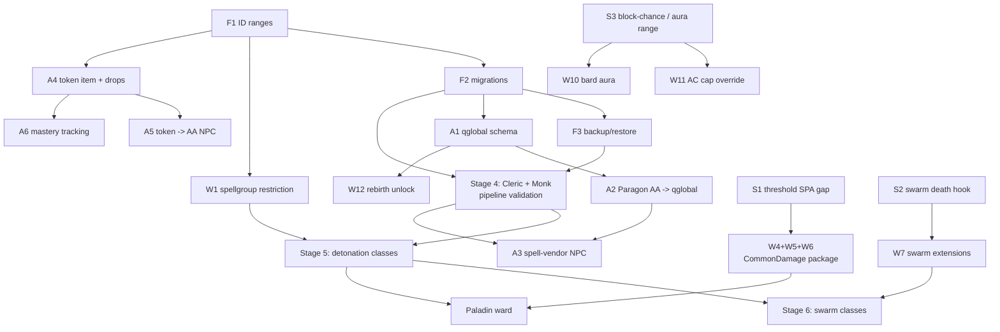

# WorldDungeon — Development Roadmap

Dependency-ordered plan. Derived from the design vault (`New Ideas/EQ/WorldDungeon/` in
Obsidian); the vault holds the *design*, this file holds the *work*.

**Ordering rule:** nothing appears before the thing it depends on. Stages are hard gates —
don't start stage N+1 items whose dependencies sit in stage N. Within a stage, items are
independent and can be done in any order or in parallel.

**Two tracks run concurrently:**

- **Track A — Entitlement, economy, content.** Quest script and DB data. *This is the MVP
  critical path.* v1 does not ship without it.
- **Track B — Engine.** C++ in `zone/`. Makes classes feel right. Mostly **not** on the
  critical path.

They are near-independent and should be worked in parallel. The common failure mode is
sinking months into Track B and having nothing playable.

IDs are stable — `W*` items keep the meaning they had in the previous revision. Evidence for
source claims is in [PHASE-0-SOURCE-VERIFICATION.md](PHASE-0-SOURCE-VERIFICATION.md).

Sizes: **S** ≈ one sitting · **M** ≈ multi-day · **L** ≈ spike before estimating.
Status: `open` · `in-progress` · `blocked` · `done`

---

## Where things stand

**Done so far — no engine code written yet.** Everything to date is investigation and tooling.

| | |
|---|---|
| ✅ **Phase 0 source verification** | V1–V5 and V15 answered against the source. See [PHASE-0-SOURCE-VERIFICATION.md](PHASE-0-SOURCE-VERIFICATION.md). Reshaped the C++ bill: W1 is new and now first, W5/W6 shrank, the Ranger de-risked. |
| ✅ **Zone connectivity mapped** | Four connection mechanisms identified and dumped. See [ZONE-CONNECTIVITY.md](ZONE-CONNECTIVITY.md). |
| ✅ **Tooling** | [`tools/dump-zone-graph.sh`](tools/dump-zone-graph.sh) and [`tools/zone-map-graph.py`](tools/zone-map-graph.py), documented in [tools/README.md](tools/README.md). |
| ✅ **F1 ID range policy** | **Decided.** See [F1-ID-RANGES.md](F1-ID-RANGES.md). Custom bases fixed, `npc_types` convention kept, `zoneidnumber` ceiling myth busted, qglobal naming and W1's restriction id allocated. |

**Current fork: `feature/foundations`** — scope is F1, F4, F2, F3 plus the three Stage 2 spikes
(S1/S2/S3). No engine source touched on this branch; the spikes are read-only source analysis
whose only job is to shrink the Stage 3/6/7 bill before anyone writes C++.

Progress: **F1 ✅ · F2 ✅ · F3 ✅ · F4 ✅ · S1 ✅ · S2 ✅ · S3 ✅ — fork scope complete.**

**Stage 0 is closed and Stage 2 is closed.** Nothing on the board is gated on foundations any
more. The next move is the parallel split: **Stage 1 (W1+W2+W3)** as one engine branch, and
**A1 → A2** on the script side. **P1 (Cleric + Monk)** is also unblocked now that F2/F3 exist,
and it's the item that proves F1 and F2 were right.

Two things this fork produced that change other items:

- **The spikes paid for themselves.** **W6 is closed entirely**, W5 → XS, W7 → S, W10 → XS, W11
  → M+. One vault assumption (V20, SPA 270 as aura range) was simply wrong and is now corrected
  before anyone built against it. See [STAGE-2-SPIKES.md](STAGE-2-SPIKES.md).
- **The backup story was broken in two independent ways** and neither had ever been noticed,
  because nothing had ever been restored. See F3.

⏳ **One decision is outstanding and belongs to the owner, not the code:** when backups run, and
whether they leave this box. See F3.

### Environment notes for a fresh session

- Server is up: 1 `world`, 1 `ucs`, 25 `zone`, on the correct `v16-dev` image.
- **Docker from a non-interactive shell needs `sg docker -c "..."`** — the `docker` group isn't
  active until a fresh login (akk-stack README §6). Both tools handle this automatically.
- Git pushes work from the host without entering the container by pointing at the deploy key:
  `GIT_SSH_COMMAND="ssh -i /opt/eqemu-servers/akk-stack/assets/ssh/id_ed25519 -o IdentitiesOnly=yes"`
- Branch `custom`, in sync with `origin/custom`. All work so far is docs and tools — **zero
  changes to engine source**, so `git diff upstream/master -- zone/ common/` is still empty.

### Corrections to the design vault

Two errors found while working, worth fixing in Obsidian:

- The implementation primer's P4 table list names **`aa_rank`**; the actual table is
  **`aa_ranks`**. (`aa_ability`, `aa_rank_effects`, `aa_rank_prereqs` are all correct.)
- Zone counts quoted as 618 are **row** counts. There are **482 distinct zones**; the rest are
  per-version rows.

---

## Dependency graph



---

## Stage 0 — Foundations · blocks everything

**None of this is in the design vault.** It's the gap between "we have a spec" and "we can
author anything without painting ourselves into a corner." Do it first; it is cheap now and
expensive later.

### F1 — Custom ID range allocation policy · **S** · ✅ **done** · *no dependencies*

**Decided and recorded in [F1-ID-RANGES.md](F1-ID-RANGES.md).** That file is now the authority;
claim blocks there in the same commit that first writes rows into them.

Summary of what was settled:

- **Custom bases fixed** for spells (100,000), spellgroups (500,000), items (1,000,000), AA
  ability/ranks (100,000), doors (100,000), zone_points (100,000).
- **`npc_types.id` follows the convention** `zoneidnumber * 1000 + n`. The 2,000,040 max turned
  out to be 27 outlier rows; 67,405 of 67,530 obey it. **No C++ derives zone from NPC id at
  runtime** — only one optional SQL script does — so the convention is an authoring contract,
  cheap to keep. The 1,000-per-zone cap isn't a real constraint because `npc_types` rows aren't
  owned by a zone (`spawn2` carries the `zoneid`), so one row spawns in many zones. Flat
  overflow range **3,000,000+** is the documented escape hatch. Per-zone band conflict check is
  mandatory before claiming — there is **no blanket-safe sub-band** (38 zones have stock NPCs at
  `n >= 500`).
- **`zoneidnumber` 999 is convention, not a ceiling.** `int32_t` in the repository; the narrowest
  wire struct is `uint16`, so the protocol ceiling is 65,535. **The zone id is not the
  constraint — the short name is**, since the server sends `zone_short_name[32]` and the client
  loads geometry by name. A7 should still allocate below 999 (517 free, ~48 needed).
  ⚠️ One thing left unproven: whether the ROF2 client keeps its own zone-id table. **A7 must
  boot one custom zone before authoring all 48.**
- **qglobal naming:** `wd_<domain>_<key>`, integer values, colon-delimited flat strings where
  structure is unavoidable, never JSON.
- **W1's `SpellRestriction` ID: `1000`** — `SpellRestrictionTargetHasSpellGroup`. One id
  permanently; the spellgroup comes from the spell's limit/max field.

### F2 — Repeatable DB migration / seed mechanism · **S–M** · ✅ **done** · *depends: F1*

**Built at [`worlddungeon/`](../../worlddungeon/README.md)** — a new **top-level** directory,
deliberately outside every upstream path so an `upstream/master` merge can never conflict with
it.

```
worlddungeon/
  bin/wd-migrate      the runner
  bin/wd-backup       F3's dump/restore/verify
  migrations/         ordered, immutable .sql
```

`wd-migrate status | up [--dry-run] | verify | new <name>`. Migrations are applied once in
numeric order and tracked by **sha256** in a `wd_migration` table, so:

- an applied file is **immutable** — editing one reports `DRIFTED` and `up` refuses to run;
- a migration that **fails is not recorded**, so it retries cleanly on the next `up`;
- a version applied but missing from disk is reported too.

MySQL DDL isn't transactional, so **every migration must be idempotent** — the README spells out
the patterns, and `new` scaffolds a header that reminds you.

**Verified end to end:** dry-run, apply, idempotent re-run, checksum drift detection, refusal to
apply on a drifted history, and a deliberately broken migration confirmed *not* recorded as
applied.

First migration `0001_id_range_registry` puts F1's policy in the DB as `wd_id_range`, plus
`wd_npc_band` for the per-zone NPC sub-band claims F1 requires.

### F3 — Backup and restore discipline · **S** · ✅ **done (one decision outstanding)** · *depends: F2*

**Restore is proven.** Dump → restore into a scratch database → compare → drop:

| | live (`peq`) | restored |
|---|---:|---:|
| tables | 234 | 234 |
| items | 117,944 | 117,944 |
| spells | 40,722 | 40,722 |
| npc_types | 67,530 | 67,530 |
| `wd_migration` | 1 | 1 |

Run it yourself with `worlddungeon/bin/wd-backup verify <file>` — it uses a scratch database and
drops it afterwards, so it never endangers the live one.

#### Two things were broken, and F3 is why we know

**1. `make mysql-backup` does not work.** It redirects `mysqldump` to `/var/lib/mysql` *inside*
the container, then tries to `mv` the result out of `./data/mariadb` on the host. The file is
written as **root**, the host user is not root, and the move fails with `Permission denied` —
leaving a **269 MB root-owned dump stranded in the MariaDB data directory** and no backup in
`backup/database/`. This reproduces on a stock akk-stack checkout. *(The stranded file from the
test run has been removed.)*

**2. There are currently no automated backups at all.** The `backup-cron` container **is not in
the running compose stack**, and even if it were, `backup/backup-database.sh` is **Dropbox-only**
— it dumps to `/tmp` inside the container, uploads, and keeps no local copy. It also opens with
`validate-dropbox.sh` under `set -e`, so with no `~/.dropbox_uploader` config the whole backup
**aborts**. Dropbox is not configured here.

So before this item, the situation was: the manual backup was broken, the scheduled backup
wasn't running, and nothing had ever been restored. Exactly the failure F3 exists to catch, and
much cheaper to find now than after P1 authors real content.

#### The replacement

`worlddungeon/bin/wd-backup` — streams `mysqldump` to the host over stdout, so nothing is ever
written inside the container and the ownership bug cannot recur.

| Command | Does |
|---|---|
| `dump [file]` | gzipped dump to `backup/database/wd-<db>-<timestamp>.sql.gz` |
| `restore <file> <db>` | drops and recreates a **named** target; prompts twice if it's the live DB |
| `verify <file>` | restore to scratch, compare row counts, drop scratch |
| `prune [days]` | delete `wd-*.sql.gz` older than N days (default 14) |

`dump` rejects its own output if it isn't valid gzip or lacks the `Dump completed` trailer — a
truncated dump is worse than no dump, because it looks like a backup. Measured: 31 MB gzipped,
~2 min.

#### ⏳ Outstanding — needs a decision, not code

**When does it run?** Nothing is scheduled yet. The intended line, once approved:

```
0 4 * * *  cd /opt/eqemu-servers/akk-stack/code && ./worlddungeon/bin/wd-backup dump && ./worlddungeon/bin/wd-backup prune 14
```

**Not installed** — a host crontab is persistent config and is the user's call. Also worth
deciding: whether backups should leave this box at all (the Dropbox path exists but is
unconfigured), because a backup on the same disk as the database is not a backup.

#### Rebuild-from-empty

`make init-peq-database && ./worlddungeon/bin/wd-migrate up` is the documented path, and
`wd_migration` is itself part of the custom layer, so a reinit wipes it and `up` correctly
replays from scratch. **The reinit half is not yet exercised** — it destroys the live database,
so it should be run deliberately rather than as a side effect of this fork.

### F4 — Prove the full loop once · **S** · ✅ **done** · *no dependencies*

**The toolchain works end to end.** Exercised once as a gate, then reverted — no engine source
changed on this branch.

What was actually run:

1. Edited `common/shareddb.cpp:913`, appending a `[WD-F4-PROBE]` marker to the item-load line.
2. Built in-container: `docker compose exec eqemu-server bash -lc 'cd ~/code/build && ninja -j$(nproc-2)'`
   — 12 targets relinked, exit 0, ~4 min.
3. `./bin/spire spire:launcher restart` from `~/server`.
4. Verified in the zone logs: `Loaded [117,944] items via shared memory [WD-F4-PROBE]`,
   in **25 of 25** zone logs.
5. Reverted, rebuilt, restarted — 25 zone processes back up, marker gone, item count unchanged.

**Facts worth keeping for the next session:**

- The build command is the container alias **`n`** = `cd ~/code/build && ninja -j$(expr $(nproc) - 2)`.
  `~/code` in the container is a bind mount of this repo, so a host-side edit is immediately
  visible and the container sees the same git branch.
- **`~/server/bin/zone` and `~/server/bin/world` are symlinks into `~/code/build/bin/`**, so a
  successful ninja build is live at the next restart — no install or copy step, and no
  `create-symlinks.pl` run needed for an incremental change.
- Restart is `./bin/spire spire:launcher restart`, not `make restart`, and takes ~45s for all
  25 zones to come back.
- The README warning holds: check a **zone** log, not world. World reporting `Loaded [0] items`
  is normal.

---

## Stage 1 — Zero-dependency engine primitives · Track B

All three are **S**, mutually independent, and unblock more than anything else on the board.
One branch, one build, one test pass.

### W1 — Spellgroup-on-target cast restriction · **S** · open · *depends: F1*

**Unblocks:** Wizard, Necromancer, Rogue, Druid, Berserker, Beastlord, Enchanter, Paladin (8)

Add a `SpellRestriction` ID meaning *"target has an active buff whose spell belongs to
spellgroup N"*, making the detonation pattern data-only.

- `common/spdat.h:298` — new entry in `enum SpellRestriction`.
- `zone/spell_effects.cpp:7571` — one branch in `Mob::PassCastRestriction()`. Scan the buff
  array, map each buff's `spell_id` to `spells[].spellgroup`, compare.
- No new consumers. Inherits `cast_restriction`, `caster_requirement_id`, SPA 442/443, and the
  SPA 0/79 LIMIT field for free.

**Design note:** the restriction must encode *which* spellgroup. Read the spellgroup from the
spell's limit/max field alongside one restriction ID, rather than reserving an ID block — the
enum stays clean and there's no ceiling on spellgroup count.

**Done when:** a detonator spell fails on an unbuffed target and lands on a buffed one, with
no per-class C++.

### W2 — Ally-target expansion (primer P3.6) · **S** · open · *no dependencies*

**Unblocks:** Warrior, Cleric, Bard, Shaman, Paladin — *and the entire solo-first premise (D1)*

Group-target resolution must also resolve the caster's owned NPCs: pets, warders, blood
golems, dopplegangers, warhorn mercs, curse-raised minions, swarm bodies. Temp/swarm bodies at
reduced weight (design suggests 50%).

- Extend the group-target path used by `Mob::EntityListToSpellTargets`.
- Swarm bodies: `GetSwarmInfo()->owner_id` (`zone/aa.cpp:159`). Commanded pets: `GetOwnerID()`.

### W3 — Pet owner-redirect for beneficial effects · **S** · open · *no dependencies*

**Unblocks:** Shadowknight (Blood Golem), Beastlord (reciprocal procs, support-warder spec,
warder-triggered combos)

Pet self-benefit lands on the pet. Two hardcoded sites:

- `zone/mob.cpp:6850` — `Mob::MeleeLifeTap()` calls `HealDamage()` on `this`.
- `zone/mob.cpp:5366` — `Mob::ExecWeaponProc()` calls `SpellFinished(spell_id, this, ...)`.

Gate the redirect on a pet flag or rule — stock pets keep healing themselves.

---

## Stage 2 — Re-scope spikes · Track B · *do before writing any more C++*

Cheap source reads that prevent building things the engine already has. Phase 0 found three
bill items were over-scoped; these check the rest. **No dependencies — can run any time,
including during Stage 1.**

**All three answered — full evidence in [STAGE-2-SPIKES.md](STAGE-2-SPIKES.md).** They removed
more work than expected and corrected one design assumption that was flatly wrong.

### S1 — Threshold / resource SPA gap analysis · **S** · ✅ **done**

`Mob::TryTriggerThreshHold()` (`zone/spell_effects.cpp:9761`) is already called from inside
`Mob::CommonDamage()` (`zone/attack.cpp:4171`, `:4196`) and already scans buffs, fades the source
buff, and casts a payload with beneficial/detrimental routing. **The only difference from what
W5 needs is the predicate** — it tests `damage > limit_value[i]` where the design wants a
resulting-HP-ratio test.

- **W5: S → XS.** One new SPA id plus one new predicate, reusing the function wholesale. Use the
  *projected* ratio `(GetHP() - damage) * 100 / GetMaxHP()`, because HP isn't subtracted until
  `zone/attack.cpp:~4265`. Copy the edge-triggered shape already at `:4292` so it fires on
  *crossing* the threshold, not on every hit while below it.
- **W6: closed.** SPA 457 `ResourceTap` is the same operation as the Wizard mana ward. Reopen
  only if authoring hits a wall.
- **W4: unchanged**, and now the only genuinely new mechanism in Stage 3 — nothing in the stock
  SPAs banks a *cumulative* total that something else can read.

### S2 — Swarm-pet death hook · **S** · ✅ **done**

**It already exists.** Phase 0 missed it because it isn't near `StartSwarmTimer()` — it's in
`NPC::Death()` at `zone/attack.cpp:2542`, which already resolves the owner and decrements
`TempPetCount`. The Enchanter buff needs one call at a site that has the owner in hand.

Hook **attack.cpp:2545 only** — the other two `SetTempPetCount(-1)` sites (`zone/npc.cpp:3266`,
`zone/pets.cpp:327`) mean "expired" and "torn down". A survival buff that fires on the duration
running out is the opposite of the intent.

**W7: M → S.** Three of five sub-items are now free; only the doppleganger runtime spell list and
Necro target inheritance remain.

### S3 — Block-chance SPA and aura range · **S** · ✅ **done**

**V6 — block is SPA 188 `IncreaseBlockChance`, and it is multiplicative on block skill**
(`zone/attack.cpp:537-546`): `chance = (GetSkill(SkillBlock) + 100) * (1 + bonus/100) / 25`. At
skill 0 that's 4%, and +100% from SPA 188 buys four percentage points. **It is weakest exactly
where the design wants block to matter.** Also gated on `CanThisClassBlock()`. The only additive
term is Heroic DEX; `IncreaseBlockChance == 10000` is an exact-match guaranteed-block sentinel,
useful for a cooldown but not as a scaling stat.

> **Decision forced, and it belongs to W11:** a meaningful pre-50 block layer needs a **flat
> additive term in C++**. Either fold that into W11 or drop pre-50 block from the design — but
> don't author spells against SPA 188 expecting them to matter. **W11: M → M+.**

**V20 is wrong.** SPA 270 is `BardSongRange` (`common/spdat.h:1333`), not aura range. **Aura
radius is the `auras.distance` DB column** — squared once at load (`zone/aura.cpp:967`), so
author plain radii in world units. The E4 scope filter is likewise a column, `auras.spawn_type`.
**W10: S → XS**, essentially no engine work. *Correct the vault's Bard Aura Patch.*

---

## Stage 3 — The shared `CommonDamage()` hook package · Track B

**Depends: S1.** Three features, one hook site, eight classes. Build as one package — the
design docs are emphatic about this and they're right.

### W4 — Accumulator (primer P3.2) · **M** · open

**Unblocks:** Paladin (ward→detonation), Shadowknight (banked taps), Warrior (damage spread),
Rogue (combo counter)

Track how much a buff has absorbed or dealt. No native equivalent.

- Absorb: hook `Mob::ReduceDamage()` in `zone/attack.cpp`, where SPA 55/161/162 already
  decrement.
- Damage dealt: hook the `Mob::CommonDamage()` out-path.
- Storage: a server-side field on the buff struct, never sent to the client. Data buckets
  would churn on every swing — do not use them here.
- Readout: on fade via SPA 373 (confirmed to fire on depletion) or on detonation via W1.

### W5 — Threshold trigger (primer P3.4) · **XS** · open · *S1 done — reduced from S*

**Unblocks:** Necromancer (life ward), Shadowknight (Famine stance), Berserker (execute)

One new SPA id plus one new predicate in `Mob::TryTriggerThreshHold()`
(`zone/spell_effects.cpp:9761`), which already does the buff scan, fade and payload routing. Use
the projected ratio and the edge-triggered shape at `zone/attack.cpp:4292`. See S1.

### W6 — Wizard mana ward conversion · ~~**S**~~ · ✅ **closed — not needed** · *S1*

Covered by SPA 457 `ResourceTap`, which converts a % of DD/DoT damage to hp/mana/endurance —
the same operation. Reopen only if authoring an actual mana-ward spell hits a wall.

---

## Stage 4 — Data pipeline validation · Track A+B

**Depends: F2, F3.** *Independent of Stages 1–3 — run it in parallel.*

### P1 — Cleric and Monk · **M** · open

Neither needs any custom C++ (vault Phase 1). The Cleric validates the spell/heal/AA pipeline;
the Monk validates stances, spellgroups and disciplines. Between them they exercise nearly
every data mechanism the other 14 classes need.

**This is the first content that proves F1/F2 actually work.** If ID ranges or migrations are
wrong, find out on two classes, not sixteen.

---

## Stage 5 — Detonation rollout · Track A (data-only)

**Depends: W1, P1.** Once the restriction exists and the pipeline is proven, this is spell
authoring, not code.

### P2 — Wizard · **M** · open

**Build first as the reference template** (vault C13). Every later detonation class copies its
shape.

### P3 — Necromancer, Rogue, Druid, Berserker, Beastlord, Enchanter · **M each** · open

Apply the P3.1 pattern. *(Their swarm halves are Stage 6.)*

### P4 — Paladin ward · **M** · open · *also depends: W4*

The only detonation class that also needs the accumulator — its detonation scales off absorbed
damage.

---

## Stage 6 — Swarm classes · Track B then A

**Depends: S2, and Stage 5 for the affected classes' non-swarm halves.**

### W7 — Swarm AI extensions (primer P3.5) · **S** · open · *reduced again by S2*

Three of five documented sub-items are already handled (V4, plus S2):

- ~~Independent caps per swarm subtype~~ — **free.** Caps are per-cast; no cross-cast
  accounting exists (`zone/aa.cpp:114`).
- ~~Enchanter copies breaking mez~~ — **already built.** `RuleB(Spells, SwarmPetTargetLock)` or
  the `sticktarg` argument sets `SetPetTargetLockID` + `AggroImmunity` (`zone/aa.cpp:161-172`).

Genuinely remaining:

- **Doppleganger runtime spell list (Enchanter E7).** Swarm spell lists are static from
  `npc_types`. Needs runtime assignment: snapshot the memmed spellbar at summon, filter by an
  allow-list of categories. Seam exists at the per-cast `NPCType` copy (`zone/aa.cpp:103-109`).
- **Necro target inheritance / xtarget-clearing.** Target-lock is the opposite behaviour.
  Needs "acquire the owner's next target after the current dies."

And one more is now free:

- ~~Swarm-pet death hook~~ — **already built.** `NPC::Death()` at `zone/attack.cpp:2542` already
  resolves the owner and decrements the count. Hook that site only, not the expiry/teardown
  ones. See S2.

### P5 — Necro minions, Enchanter dopplegangers, Ranger warhorns, Rogue clone · open

---

## Stage 7 — Remaining engine work · Track B

All independent of each other. Order by whichever class you want to finish.

### W8 — Damage redirection · **M** · open

**Unblocks:** Warrior (§9c interception, §9e Human Shield). Build interception first with a
direction parameter; derive Human Shield from it (vault C1).

### W9 — DoT spread engine · **M** · open

**Unblocks:** Druid (§9a). Per-tick target scan plus duration copy. **Profile the cost** — the
one item with real performance-budget risk; see the vault's *Performance Budget &
Determinism Rules*.

### W10 — Bard aura projection · **XS** · open · *S3 done — reduced from S*

Range is the `auras.distance` column (squared at load, `zone/aura.cpp:967` — author plain radii)
and the E4 scope filter is `auras.spawn_type`. Essentially no engine work. **The vault's *Bard
Aura Patch* names SPA 270 for range and is wrong** — 270 is `BardSongRange`. Fix it in Obsidian.

### W11 — AC / avoidance cap override · **M+** · open · *S3 done — grew*

**Unblocks:** all classes. Per *Combat Balance Envelope* §11.8.

**Now also owns the flat additive block term**, if pre-50 block is to mean anything: SPA 188 is
multiplicative on block skill and buys ~4 percentage points at skill 0. Decide here whether
pre-50 block stays in the design. See S3.

---

## Track A — Entitlement, economy, content · *the MVP critical path*

Runs in parallel with everything above. Only **A3** has a Track B dependency.

### A1 — qglobal schema · **S** · open · *depends: F2*

Key naming, value encoding, and per-character scoping for: Paragon path rank, specialization
flag, rebirth count, level ceiling, mastery. Design the namespace once — every script below
reads it.

### A2 — Paragon path AA → qglobal flip · **M** · open · *depends: A1*

AA definitions per path; rank purchase flips the entitlement qglobal. The front half of the
delivery spine (primer P1).

### A3 — Spell-vendor NPC script · **M** · open · *depends: A2, P1*

Reads the qglobal, scribes entitled spell IDs. Gates ranks 1–5 on path entitlement, 6–10 on
the specialization qglobal, dipped paths at rank 3.

**The back half of the delivery spine — the mechanism that makes cross-class Paragon dipping
work without touching class masks.** Needs real spells to hand out, hence the P1 dependency.

### A4 — Token item and drop sources · **S** · open · *depends: F1*

### A5 — Token → AA vendor NPC · **M** · open · *depends: A4*

### A6 — Mastery / token tracking · **M** · open · *depends: A4, A1*

### W12 — Rebirth level-unlock · **S** · open · *depends: A1*

Vault-verified feasible: `MaxExpLevel` = 50 plus `quest::level()` grants on rebirth. Mostly
script.

Open verification: ROF2 skill-cap curves for 51–65; per-character qglobal ceiling enforcement.

### A7 — Zone topology build-out · **M** · open · *was L — reduced*

The v1 slice per *Build Order & MVP*: Kerra → Nexus → first ~5–6 zones of the North/Underrot
wing (T1–T3), through the Rivervale midpoint safe pocket. **Not** all 15 North zones.

**Reduced from L to M by the connectivity work.** Bespoke edges need no engine code — they are
`zone_points` rows (walk-through) and `doors` rows with `opentype` 57–58 (clicky portals),
which lands them inside **F2's** migration mechanism. See
[ZONE-CONNECTIVITY.md](ZONE-CONNECTIVITY.md).

**LDoN already ships the hub-and-wing pattern** the design wants: `sro` has ten `opentype` 58
portals to `ruja`…`rujj`, which nothing else reaches. Copy that shape for Nexus → wing zones.

Still blocked on vault decisions §1.4–1.6 (zone naming). The §1.3 bespoke-adjacency audit is
now **mechanical**: dump `edges.tsv`, diff the proposed adjacency list against it, and anything
appearing in both is an accidental live-EQ match to rewire.

Design question this surfaced, worth settling here rather than discovering later: **25% of
stock connections are one-way**, and 117 zones sit in the mainland cluster without being able
to round-trip back into it. One-way edges should be a deliberate choice for a Souls-style
"access is free, power is the wall" world, not inherited from PEQ by accident.

### A8 — Safe-zone travel and ports · **M** · open · *depends: A7*

Also pure data. `doors.keyitem` gates a portal on an item with automatic key-ring
registration; qglobal gating from A2/A3 covers the rest.

### A9 — Recommended-Level gear scaling · **M** · open

Needs the EQEmu Recommended-Level formula verified in source (vault *Open Decisions*, §5.2) —
**add this to Stage 2 as a spike if A9 is scheduled early.**

### A10 — Mob prefixes · **M** · open · *depends: A7*

v1 wants 2–3 only: Fleer + Bloater + one Warded type.

---

## Recommended first moves

1. **F1** — first thing. The measurements are already in the table above, so this is a
   decision to make and write down, not research. Two real questions inside it: the
   `npc_types.id` convention, and whether zone id 999 is a hard ceiling.
2. **F4** — prove the edit → `n` → `make restart` → zone-boots loop once, before the first
   real change depends on it.
3. **F2** — the highest-risk omission on the board. Nothing authored is safe until custom
   data is replayable from version-controlled SQL.
4. Then split into two parallel tracks: **Stage 1 (W1+W2+W3)** as one engine branch, and
   **A1 → A2** on the script side.
5. **Stage 2 spikes** whenever there's an hour spare; they only ever remove work — they've
   already shrunk three bill items.

## Explicitly deferred

Per *Build Order & MVP*, not v1: T7–T10 frontier tiers, the South/Nadox deep wing, capstone
instances, the solo/duo raid instance, the betting arena, the full custom spell library.

The betting engine is the heaviest scripting item in the entire design and is correctly
scheduled last.

---

## Data-only — no engine work needed

Recorded so nobody re-opens them:

| Design element | Mechanism |
|---|---|
| Stances, one-at-a-time (primer P3.3) | Same `spellgroup`, same rank — native overwrite |
| Monk dual stance pool | Two spellgroups, `monk_offense` / `monk_defense` |
| 1–10 tier lines (D2) | `spellgroup` ranks 1–10, higher auto-overwrites |
| Bard group lifesteal | SPA 178 as a buff — each member taps for themselves (V3) |
| Ward fires on depletion, not just timeout | SPA 373 `CastOnFadeEffectAlways` (V2) |
| Ranger archery specialization (E6) | Real archery — full impl + Lua bindings (V15) |
| Swarm bodies and pet power | `pets` table via `GetPoweredPetEntry()` |
| Enchanter copies not breaking mez | `SwarmPetTargetLock` rule / `sticktarg` (V4) |
| Cleric, Monk | Zero custom C++ — build first to validate the pipeline |
