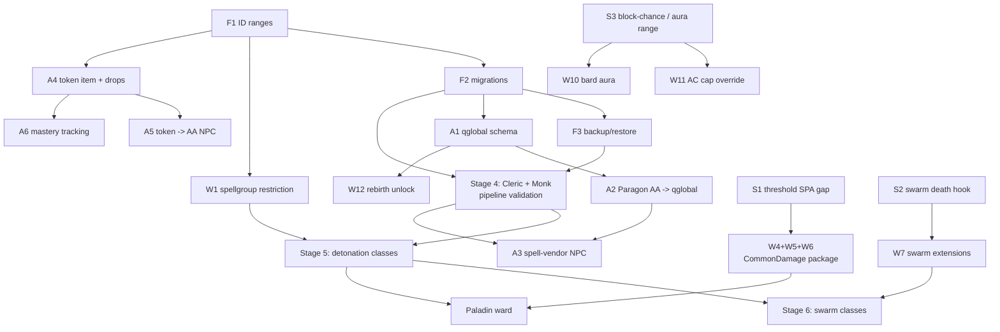

# WorldDungeon — Development Roadmap

Dependency-ordered plan. Derived from the design vault (`New Ideas/EQ/WorldDungeon/` in
Obsidian); the vault holds the *design*, this file holds the *work*.

**Ordering rule:** nothing appears before the thing it depends on. Stages are hard gates —
don't start stage N+1 items whose dependencies sit in stage N. Within a stage, items are
independent and can be done in any order or in parallel.

**Two tracks run concurrently:**

- **Track A — Entitlement, economy, content.** Quest script and DB data. *This is the MVP
  critical path.* v1 does not ship without it.
- **Track B — Engine.** C++ in `zone/`. Makes classes feel right. Mostly **not** on the
  critical path.

They are near-independent and should be worked in parallel. The common failure mode is
sinking months into Track B and having nothing playable.

IDs are stable — `W*` items keep the meaning they had in the previous revision. Evidence for
source claims is in [PHASE-0-SOURCE-VERIFICATION.md](PHASE-0-SOURCE-VERIFICATION.md).

Sizes: **S** ≈ one sitting · **M** ≈ multi-day · **L** ≈ spike before estimating.
Status: `open` · `in-progress` · `blocked` · `done`

---

## Dependency graph

---

## Stage 0 — Foundations · blocks everything

**None of this is in the design vault.** It's the gap between "we have a spec" and "we can
author anything without painting ourselves into a corner." Do it first; it is cheap now and
expensive later.

### F1 — Custom ID range allocation policy · **S** · open · *no dependencies*

Reserve and document ID ranges for every custom record type, so custom data never collides
with stock ROF2 data or with a future upstream merge.

Needs a range decided for: `spells_new.id`, `spells_new.spellgroup`, `items.id`,
`npc_types.id`, `aa_ability.id`, qglobal key naming convention, and the new
`SpellRestriction` ID from W1.

**Method:** query the max stock ID in each table on a freshly seeded PEQ database, then start
custom ranges an order of magnitude clear of it. Record the numbers in this repo, not in
someone's head.

**Why first:** every subsequent item writes rows. Renumbering authored content later means
rewriting every cross-reference — spell→spellgroup, AA→spell, vendor script→spell id.

### F2 — Repeatable DB migration / seed mechanism · **S–M** · open · *depends: F1*

Custom data must be version-controlled and replayable — a directory of ordered `.sql` files
in this repo, applied by a script.

**Why:** without it, custom content exists only as mutations in one MariaDB volume. `make
init-peq-database` overwrites the database (README §6), the prod box needs the same content
from scratch, and there's no diff, no review, and no rollback. This is the single highest-risk
omission in the current plan.

### F3 — Backup and restore discipline · **S** · open · *depends: F2*

`make mysql-backup` exists. Establish when it runs and prove a restore works *before* there's
anything worth losing. Confirm F2's seed path reproduces a working DB from empty.

### F4 — Prove the full loop once · **S** · open · *no dependencies*

Edit → `n` → `make restart` → zone boots → nonzero item count, per README §4. Do it once as a
gate so the first real change isn't also the first time the toolchain is exercised.

Note the README's warning: a clean compile is not a working server. Check a **zone** log for
`Loaded [117,944] items`; world reporting `Loaded [0] items` is normal.

---

## Stage 1 — Zero-dependency engine primitives · Track B

All three are **S**, mutually independent, and unblock more than anything else on the board.
One branch, one build, one test pass.

### W1 — Spellgroup-on-target cast restriction · **S** · open · *depends: F1*

**Unblocks:** Wizard, Necromancer, Rogue, Druid, Berserker, Beastlord, Enchanter, Paladin (8)

Add a `SpellRestriction` ID meaning *"target has an active buff whose spell belongs to
spellgroup N"*, making the detonation pattern data-only.

- `common/spdat.h:298` — new entry in `enum SpellRestriction`.
- `zone/spell_effects.cpp:7571` — one branch in `Mob::PassCastRestriction()`. Scan the buff
  array, map each buff's `spell_id` to `spells[].spellgroup`, compare.
- No new consumers. Inherits `cast_restriction`, `caster_requirement_id`, SPA 442/443, and the
  SPA 0/79 LIMIT field for free.

**Design note:** the restriction must encode *which* spellgroup. Read the spellgroup from the
spell's limit/max field alongside one restriction ID, rather than reserving an ID block — the
enum stays clean and there's no ceiling on spellgroup count.

**Done when:** a detonator spell fails on an unbuffed target and lands on a buffed one, with
no per-class C++.

### W2 — Ally-target expansion (primer P3.6) · **S** · open · *no dependencies*

**Unblocks:** Warrior, Cleric, Bard, Shaman, Paladin — *and the entire solo-first premise (D1)*

Group-target resolution must also resolve the caster's owned NPCs: pets, warders, blood
golems, dopplegangers, warhorn mercs, curse-raised minions, swarm bodies. Temp/swarm bodies at
reduced weight (design suggests 50%).

- Extend the group-target path used by `Mob::EntityListToSpellTargets`.
- Swarm bodies: `GetSwarmInfo()->owner_id` (`zone/aa.cpp:159`). Commanded pets: `GetOwnerID()`.

### W3 — Pet owner-redirect for beneficial effects · **S** · open · *no dependencies*

**Unblocks:** Shadowknight (Blood Golem), Beastlord (reciprocal procs, support-warder spec,
warder-triggered combos)

Pet self-benefit lands on the pet. Two hardcoded sites:

- `zone/mob.cpp:6850` — `Mob::MeleeLifeTap()` calls `HealDamage()` on `this`.
- `zone/mob.cpp:5366` — `Mob::ExecWeaponProc()` calls `SpellFinished(spell_id, this, ...)`.

Gate the redirect on a pet flag or rule — stock pets keep healing themselves.

---

## Stage 2 — Re-scope spikes · Track B · *do before writing any more C++*

Cheap source reads that prevent building things the engine already has. Phase 0 found three
bill items were over-scoped; these check the rest. **No dependencies — can run any time,
including during Stage 1.**

### S1 — Threshold / resource SPA gap analysis · **S** · open

SPAs 450, 451, 452, 453, 454 and 457 are marked implemented and cover part of W5 and possibly
all of W6. Determine the gap: the design needs *"below X% max HP"*, while 453/454 are *"single
hit over X damage"*. **Gates W4/W5/W6 scope.**

### S2 — Swarm-pet death hook · **S** · open

Not found in Phase 0. Gates the Enchanter's count-driven survival buff. Start at
`StartSwarmTimer()` and the `SwarmPet` struct. **Gates W7 scope.**

### S3 — Block-chance SPA and aura range · **S** · open

Vault V6 (block-chance SPA number, pre-50 viability) and V20 (SPA 270 aura-range assumption).
**Gates W10 and W11 scope.**

---

## Stage 3 — The shared `CommonDamage()` hook package · Track B

**Depends: S1.** Three features, one hook site, eight classes. Build as one package — the
design docs are emphatic about this and they're right.

### W4 — Accumulator (primer P3.2) · **M** · open

**Unblocks:** Paladin (ward→detonation), Shadowknight (banked taps), Warrior (damage spread),
Rogue (combo counter)

Track how much a buff has absorbed or dealt. No native equivalent.

- Absorb: hook `Mob::ReduceDamage()` in `zone/attack.cpp`, where SPA 55/161/162 already
  decrement.
- Damage dealt: hook the `Mob::CommonDamage()` out-path.
- Storage: a server-side field on the buff struct, never sent to the client. Data buckets
  would churn on every swing — do not use them here.
- Readout: on fade via SPA 373 (confirmed to fire on depletion) or on detonation via W1.

### W5 — Threshold trigger (primer P3.4) · **S** · open · *depends: S1*

**Unblocks:** Necromancer (life ward), Shadowknight (Famine stance), Berserker (execute)

Build only S1's identified gap: a post-damage HP-ratio check in `Mob::CommonDamage()` firing a
dormant buff's payload.

### W6 — Wizard mana ward conversion · **S** · open · *depends: S1*

Same hook. May be fully covered by SPA 457 `ResourceTap` — S1 decides whether this item exists
at all.

---

## Stage 4 — Data pipeline validation · Track A+B

**Depends: F2, F3.** *Independent of Stages 1–3 — run it in parallel.*

### P1 — Cleric and Monk · **M** · open

Neither needs any custom C++ (vault Phase 1). The Cleric validates the spell/heal/AA pipeline;
the Monk validates stances, spellgroups and disciplines. Between them they exercise nearly
every data mechanism the other 14 classes need.

**This is the first content that proves F1/F2 actually work.** If ID ranges or migrations are
wrong, find out on two classes, not sixteen.

---

## Stage 5 — Detonation rollout · Track A (data-only)

**Depends: W1, P1.** Once the restriction exists and the pipeline is proven, this is spell
authoring, not code.

### P2 — Wizard · **M** · open

**Build first as the reference template** (vault C13). Every later detonation class copies its
shape.

### P3 — Necromancer, Rogue, Druid, Berserker, Beastlord, Enchanter · **M each** · open

Apply the P3.1 pattern. *(Their swarm halves are Stage 6.)*

### P4 — Paladin ward · **M** · open · *also depends: W4*

The only detonation class that also needs the accumulator — its detonation scales off absorbed
damage.

---

## Stage 6 — Swarm classes · Track B then A

**Depends: S2, and Stage 5 for the affected classes' non-swarm halves.**

### W7 — Swarm AI extensions (primer P3.5) · **M** · open · *reduced scope*

Two of four documented sub-items are already handled (see V4):

- ~~Independent caps per swarm subtype~~ — **free.** Caps are per-cast; no cross-cast
  accounting exists (`zone/aa.cpp:114`).
- ~~Enchanter copies breaking mez~~ — **already built.** `RuleB(Spells, SwarmPetTargetLock)` or
  the `sticktarg` argument sets `SetPetTargetLockID` + `AggroImmunity` (`zone/aa.cpp:161-172`).

Genuinely remaining:

- **Doppleganger runtime spell list (Enchanter E7).** Swarm spell lists are static from
  `npc_types`. Needs runtime assignment: snapshot the memmed spellbar at summon, filter by an
  allow-list of categories. Seam exists at the per-cast `NPCType` copy (`zone/aa.cpp:103-109`).
- **Necro target inheritance / xtarget-clearing.** Target-lock is the opposite behaviour.
  Needs "acquire the owner's next target after the current dies."
- **Swarm-pet death hook** — per S2.

### P5 — Necro minions, Enchanter dopplegangers, Ranger warhorns, Rogue clone · open

---

## Stage 7 — Remaining engine work · Track B

All independent of each other. Order by whichever class you want to finish.

### W8 — Damage redirection · **M** · open

**Unblocks:** Warrior (§9c interception, §9e Human Shield). Build interception first with a
direction parameter; derive Human Shield from it (vault C1).

### W9 — DoT spread engine · **M** · open

**Unblocks:** Druid (§9a). Per-tick target scan plus duration copy. **Profile the cost** — the
one item with real performance-budget risk; see the vault's *Performance Budget &
Determinism Rules*.

### W10 — Bard aura projection · **S** · open · *depends: S3*

Already fully specced in the vault's *Bard Aura Patch*. Add the E4 scope filter.

### W11 — AC / avoidance cap override · **M** · open · *depends: S3*

**Unblocks:** all classes. Per *Combat Balance Envelope* §11.8.

---

## Track A — Entitlement, economy, content · *the MVP critical path*

Runs in parallel with everything above. Only **A3** has a Track B dependency.

### A1 — qglobal schema · **S** · open · *depends: F2*

Key naming, value encoding, and per-character scoping for: Paragon path rank, specialization
flag, rebirth count, level ceiling, mastery. Design the namespace once — every script below
reads it.

### A2 — Paragon path AA → qglobal flip · **M** · open · *depends: A1*

AA definitions per path; rank purchase flips the entitlement qglobal. The front half of the
delivery spine (primer P1).

### A3 — Spell-vendor NPC script · **M** · open · *depends: A2, P1*

Reads the qglobal, scribes entitled spell IDs. Gates ranks 1–5 on path entitlement, 6–10 on
the specialization qglobal, dipped paths at rank 3.

**The back half of the delivery spine — the mechanism that makes cross-class Paragon dipping
work without touching class masks.** Needs real spells to hand out, hence the P1 dependency.

### A4 — Token item and drop sources · **S** · open · *depends: F1*

### A5 — Token → AA vendor NPC · **M** · open · *depends: A4*

### A6 — Mastery / token tracking · **M** · open · *depends: A4, A1*

### W12 — Rebirth level-unlock · **S** · open · *depends: A1*

Vault-verified feasible: `MaxExpLevel` = 50 plus `quest::level()` grants on rebirth. Mostly
script.

Open verification: ROF2 skill-cap curves for 51–65; per-character qglobal ceiling enforcement.

### A7 — Zone topology build-out · **L** · open

The v1 slice per *Build Order & MVP*: Kerra → Nexus → first ~5–6 zones of the North/Underrot
wing (T1–T3), through the Rivervale midpoint safe pocket. **Not** all 15 North zones.

Blocked on vault decisions §1.4–1.6 (zone naming) and the §1.3 bespoke-adjacency audit.

### A8 — Safe-zone travel and ports · **M** · open · *depends: A7*

### A9 — Recommended-Level gear scaling · **M** · open

Needs the EQEmu Recommended-Level formula verified in source (vault *Open Decisions*, §5.2) —
**add this to Stage 2 as a spike if A9 is scheduled early.**

### A10 — Mob prefixes · **M** · open · *depends: A7*

v1 wants 2–3 only: Fleer + Bloater + one Warded type.

---

## Recommended first moves

1. **F1** and **F4** — today. Neither depends on anything, and F1 gates all authoring.
2. **F2** — the highest-risk omission on the board.
3. Then split: **Stage 1 (W1+W2+W3)** as one engine branch, **A1→A2** on the script side.
4. **Stage 2 spikes** whenever there's an hour spare; they only ever remove work.

## Explicitly deferred

Per *Build Order & MVP*, not v1: T7–T10 frontier tiers, the South/Nadox deep wing, capstone
instances, the solo/duo raid instance, the betting arena, the full custom spell library.

The betting engine is the heaviest scripting item in the entire design and is correctly
scheduled last.

---

## Data-only — no engine work needed

Recorded so nobody re-opens them:

| Design element | Mechanism |
|---|---|
| Stances, one-at-a-time (primer P3.3) | Same `spellgroup`, same rank — native overwrite |
| Monk dual stance pool | Two spellgroups, `monk_offense` / `monk_defense` |
| 1–10 tier lines (D2) | `spellgroup` ranks 1–10, higher auto-overwrites |
| Bard group lifesteal | SPA 178 as a buff — each member taps for themselves (V3) |
| Ward fires on depletion, not just timeout | SPA 373 `CastOnFadeEffectAlways` (V2) |
| Ranger archery specialization (E6) | Real archery — full impl + Lua bindings (V15) |
| Swarm bodies and pet power | `pets` table via `GetPoweredPetEntry()` |
| Enchanter copies not breaking mez | `SwarmPetTargetLock` rule / `sticktarg` (V4) |
| Cleric, Monk | Zero custom C++ — build first to validate the pipeline |
