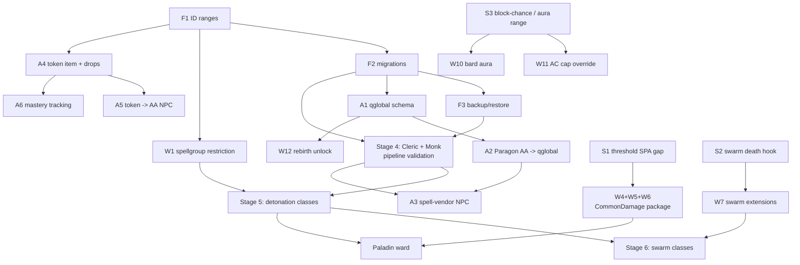

# WorldDungeon — Development Roadmap

Dependency-ordered plan. Derived from the design vault (`New Ideas/EQ/WorldDungeon/` in
Obsidian); the vault holds the *design*, this file holds the *work*.

**Ordering rule:** nothing appears before the thing it depends on. Stages are hard gates —
don't start stage N+1 items whose dependencies sit in stage N. Within a stage, items are
independent and can be done in any order or in parallel.

**Two tracks run concurrently:**

- **Track A — Entitlement, economy, content.** Quest script and DB data. *This is the MVP
  critical path.* v1 does not ship without it.
- **Track B — Engine.** C++ in `zone/`. Makes classes feel right. Mostly **not** on the
  critical path.

They are near-independent and should be worked in parallel. The common failure mode is
sinking months into Track B and having nothing playable.

IDs are stable — `W*` items keep the meaning they had in the previous revision. Evidence for
source claims is in [PHASE-0-SOURCE-VERIFICATION.md](PHASE-0-SOURCE-VERIFICATION.md).

Sizes: **S** ≈ one sitting · **M** ≈ multi-day · **L** ≈ spike before estimating.
Status: `open` · `in-progress` · `blocked` · `done`

---

## Where things stand

**Done so far — no engine code written yet.** Everything to date is investigation and tooling.

| | |
|---|---|
| ✅ **Phase 0 source verification** | V1–V5 and V15 answered against the source. See [PHASE-0-SOURCE-VERIFICATION.md](PHASE-0-SOURCE-VERIFICATION.md). Reshaped the C++ bill: W1 is new and now first, W5/W6 shrank, the Ranger de-risked. |
| ✅ **Zone connectivity mapped** | Four connection mechanisms identified and dumped. See [ZONE-CONNECTIVITY.md](ZONE-CONNECTIVITY.md). |
| ✅ **Tooling** | [`tools/dump-zone-graph.sh`](tools/dump-zone-graph.sh) and [`tools/zone-map-graph.py`](tools/zone-map-graph.py), documented in [tools/README.md](tools/README.md). |
| ✅ **F1 ID range policy** | **Decided.** See [F1-ID-RANGES.md](F1-ID-RANGES.md). Custom bases fixed, `npc_types` convention kept, `zoneidnumber` ceiling myth busted, qglobal naming and W1's restriction id allocated. |
| ✅ **F2 migrations** | [`worlddungeon/`](../../worlddungeon/README.md) — `wd-migrate`, sha256-tracked, immutable once applied. Custom data is now version-controlled and replayable. |
| ✅ **F3 backup / restore** | `wd-backup`, and a **restore actually proven** (234 tables, identical counts). Found `make mysql-backup` broken and no automated backups running at all. |
| ✅ **F4 build loop** | Edit → ninja → restart → zone boots, proved once and reverted. Commands in *Environment notes* below. |
| ✅ **Stage 2 spikes** | S1/S2/S3 answered — see [STAGE-2-SPIKES.md](STAGE-2-SPIKES.md). **W6 closed**, W5/W7 shrank, W11 grew. |
| ✅ **A1 qglobal schema** | [A1-QGLOBAL-SCHEMA.md](A1-QGLOBAL-SCHEMA.md) + migration `0002`. The `options = 5` scoping rule is the load-bearing detail. |
| 🚧 **P1 unblocked, awaiting an in-game run** | `feature/p1-cleric-monk`. Two blockers found and both fixed: the spell pipeline was dead (migration `0008`) and the mantle stacking mechanism could not work (**W13**, built + deployed) — [P1-STACKING-DEFECT.md](P1-STACKING-DEFECT.md). See *Next session*. Verification done ([P1-SOURCE-VERIFICATION.md](P1-SOURCE-VERIFICATION.md)); Cleric mantles authored as Mk. I/II/III (migration `0004`). **Still untested in-game.** Heal lines (spells 4–11) authored as migration `0005` — **written and SQL-validated (rollback test), deliberately NOT applied until the `0004` gate passes.** |
| ✅ **Caster spell design docs** | All eleven caster classes designed in [spells/](spells/) — 330 spells, id bands, spellgroups, engine deps per class. Cleric picked as first implementation per the README's review order. |
| 🔧 **First engine code** | ✅ **W1 built and compiled** — `IS_TARGET_HAS_WD_SPELLGROUP = 60000` (F1's id 1000 collided with stock; corrected). Untested in-game; see W1. |
| 🔧 **W13 stance exclusivity** | ✅ **built and deployed.** `WD_EXCLUSIVE_SPELLGROUP_BASE = 500000` + one check in `Mob::CheckStackConflict()`. Replaces the matching-layout model, which could not work. See [P1-STACKING-DEFECT.md](P1-STACKING-DEFECT.md). |
| ✅ **Spell pipeline hardened** | Migration `0010` — the eight loader-read text columns are now `NOT NULL DEFAULT ''`, so the NULL defect cannot recur and the four gated migrations need no amendment. `wd-migrate up --only <version>` added for schema fixes that must land ahead of gated content. |
| ✅ **Spell pipeline unblocked** | Migration `0008`. `shared_memory` had been aborting on a NULL varchar since the first custom row existed, so **no custom spell had ever reached a zone**. Now `Loaded [40,734]` = stock + 12. |

**`feature/foundations` is merged and done** (PR #1). Delivered: **F1 ✅ · F2 ✅ · F3 ✅ · F4 ✅ ·
S1 ✅ · S2 ✅ · S3 ✅ · A1 ✅.**

**Stage 0 and Stage 2 are both closed.** Nothing on the board is gated on foundations any more.
See *Next session* below for what to pick up.

Two things that fork produced which change other items:

- **The spikes paid for themselves.** **W6 is closed entirely**, W5 → XS, W7 → S, W11 → M+ (W10 was
  briefly recorded as XS in error and is back at S). One vault assumption (V20, SPA 270 as aura range) was simply wrong and is now corrected
  before anyone built against it. See [STAGE-2-SPIKES.md](STAGE-2-SPIKES.md).
- **The backup story was broken in two independent ways** and neither had ever been noticed,
  because nothing had ever been restored. See F3.

**Backups are now scheduled** — nightly at 04:00 to a Dropbox-synced folder, retaining 14 days.
See F3. Nothing on the board is waiting on a decision.

---

## Next session

**Everything below is on `feature/p1-cleric-monk`.** Branch from `custom` for anything unrelated.

### The gate: two defects found, one fixed

Attempting to run the `0004` test matrix surfaced two problems. **The first is fixed and the
pipeline is unblocked. The second is a design contradiction and needs a decision.**

#### ✅ 1. The spell pipeline was dead — fixed by migration `0008`

`shared_memory` was **aborting on every run** with `basic_string: construction from null is not
valid` while loading spells, and writing no usable spells file. Consequence: **migration `0004`
had been applied since 12:35 and had never once been seen by a running zone** — not because the
restart was skipped, but because the loader could not build the file at all.

Cause: `SharedDatabase::LoadSpells()` (`common/shareddb.cpp:1686-1691`) copies six nullable
varchar columns — `teleport_zone`, `you_cast`, `other_casts`, `cast_on_you`, `cast_on_other`,
`spell_fades` — into `std::string` with **no NULL guard**. `0003`/`0004` named none of them, so
every custom row took the NULL default. **No stock row is NULL in any of the six** (0 of 40,722),
which is why upstream has never hit this. The query is `ORDER BY id ASC`, so it died on the first
custom row (42700) — presenting exactly as "all stock spells work, no custom spell exists."

Fixed by [`0008_spell_text_nulls.sql`](../../worlddungeon/migrations/0008_spell_text_nulls.sql)
(applied), and then made **structurally impossible** by
[`0010_spell_text_not_null.sql`](../../worlddungeon/migrations/0010_spell_text_not_null.sql)
(applied) — see below.

> ✅ **The standing rule is retired.** `0010` sets all eight columns `NOT NULL DEFAULT ''`, so an
> INSERT that simply omits them gets a loader-safe value and an INSERT that passes `NULL` now
> **fails loudly at migration time** instead of silently killing the loader. **`0005`/`0006`/
> `0007`/`0009` therefore need no amendment.**
>
> ⚠️ **It is eight columns, not six.** `name` (row[1]) and `player_1` (row[2]) are copied by the
> same unguarded loop and are equally nullable — they had not bitten us only because our
> migrations happen to set `name`, and `0008` set `player_1`. Any earlier reference to "six" in
> this file or in `0008` is undercounting.
>
> Verified: constraint rejects an explicit NULL, an omitted column resolves to `''`, and
> `shared_memory` regenerates clean (46 MB spells file, zero errors).

Also worth knowing: **`~/server/bin` has no `shared_memory` symlink** (only `zone` and `world` are
linked), so the regeneration step has no tool wired up in the server dir. Run the build output:

```bash
sg docker -c "docker compose exec -T eqemu-server bash -lc 'cd ~/server && ../code/build/bin/shared_memory'"
```

**Verified after the fix:** loader completes clean, all 12 custom rows are in `shared/spells`, and
a restarted zone reports `Loaded [40,734] spells via shared memory` — stock 40,722 **+12**. Custom
content has now reached a running zone for the first time.

#### 🔴 2. The mantle stacking design cannot work — see [P1-STACKING-DEFECT.md](P1-STACKING-DEFECT.md)

**The two decisions locked last session are mutually exclusive.** "Stance exclusivity = matching
effect layout" is exactly the condition (`effect_match`, `zone/spells.cpp:3145`) under which the
engine **skips the SPA 149 block entirely** (`:3164`, `:3269`). The rider is never evaluated
between the mantles.

Falling through to plain value arbitration, only two of the six populated slots get a vote —
`177 DoubleAttackChance` and `323 DefensiveProc`; slots 1–3 are in `IsEffectIgnoredInStacking()`
and SPA 149 is classified **blank**. Traced outcome:

- **step 3 rejected** — slot 5 compares the two proc **spell ids** as magnitudes, `42710 < 42711`
- **step 4 rejected** — slot 4, `0 < 5`
- **step 2 and 5 fail the other way** — all voting slots equal, so `return 0` and **two mantle
  buffs coexist**
- only step 1 passes

Line 3208 reads correctly; it is simply never reached. **Blast radius includes the Monk dual
stance pool** (same mechanism, not yet authored) and invalidates two rows of the *Data-only* table
at the bottom of this file. This is the **second** correction to the same P3.3 assumption — the
matching-layout model was itself the replacement for the `spellgroup` model that
[P1-SOURCE-VERIFICATION.md](P1-SOURCE-VERIFICATION.md) §1 disproved.

**There was no data-only way out.** SPA 446-449 — the engine's purpose-built exclusivity chain —
sit at `zone/spells.cpp:3181-3205`, *inside the same `!effect_match` guard*. Every native
primitive (148, 149, 446-449) is behind it.

#### ✅ Resolved by W13 — decided, built, deployed

**Two different spells sharing a `spell_group` >= 500,000 are one stance pool: one worn at a time,
newest always wins.** One check in `Mob::CheckStackConflict()` placed *above* the `effect_match`
branch, plus `WD_EXCLUSIVE_SPELLGROUP_BASE` in `common/spdat.h`. No new column, no new SPA — F1
already allocates WD spellgroups from 500,000 and the nine mantles already share `500001`.

Stock is untouched: PEQ's highest `spell_group` is 100,276 and **zero** stock rows reach 500,000.
The Monk's two pools are simply two spellgroups. **Layout no longer matters to exclusivity**, so
the fragile unenforced invariant is gone and *"each stance gets its own proc"* is safe again —
arbitration is bypassed for same-group spells, so the proc-id tiebreak can no longer fire.

Built clean (208/208), deployed, 25 zones up on `Loaded [40,734] spells`. **Still not cast
in-game** — steps 1–5 of the matrix are now predicted to pass; **step 6 (mantle measurably
improves a heal) is the one genuinely open question.** See
[P1-STACKING-DEFECT.md](P1-STACKING-DEFECT.md) §3b and §5.

The in-game run has still not happened — it needs a client and GM `#cast`, since the mantles are
`classes2 = 254` (AA-granted). Run it to confirm the trace, but expect steps 2–5 to fail; it is
confirmation, not new information. Step 6 (Standard Mantle measurably improves a heal, proving the
focus path) is **independent of the defect** and is the one genuinely open question in the matrix.

### Then, in order

1. ~~**Cleric heal lines**~~ — ✅ **authored** as migration
   [`0005_cleric_heal_lines.sql`](../../worlddungeon/migrations/0005_cleric_heal_lines.sql)
   (spells 4–11 × Mk. I/II/III, ids 42,713–42,736, spellgroups 502,001–502,008). Formula 105
   with tier caps at ~lvl 30 / ~lvl 50 / past-65; HoTs formula 102; Reclamation tiers its
   recast; Deathward tiers its restored HP. SQL validated via transaction rollback.
   **Not applied — `wd-migrate up` is gated on the `0004` in-game test matrix.** Numbers are a
   first-pass tuning surface (see the migration header); review before applying.
1b. **Wizard** — ✅ **authored** as migrations
   [`0006_wizard_core.sql`](../../worlddungeon/migrations/0006_wizard_core.sql) (lures 1–4,
   nukes 5–10 carrying two SPA 374 rider slots each, familiars 24–26, Sculpt Spell 27) and
   [`0007_wizard_combo_riders.sql`](../../worlddungeon/migrations/0007_wizard_combo_riders.sql)
   (riders 11–14 + payloads — the P3.1 reference, normative in
   [DETONATION-PATTERN.md](DETONATION-PATTERN.md)). 58 rows total, SQL validated via rollback,
   unapplied behind the `0004` gate. `0007`'s test matrix **is** W1's done-when check.
   **Deferred:** Thermal Shock 15 + Cascade 16 (W1 extension), mana ward 17–19 (W4 pkg),
   black hole 20–23, Careful Caster 28, ports 29–30, Sculpt→AE-lure gate.
2. **Standard Mantle is now a SUSTAIN posture** (migration `0012`) — SPA 132 mana cost
   −10/18/25%, SPA 127 cast time −5/10/15%, SPA 125 heal +10/20/30%.

   **Why:** focus values never scale with level — `CalcFocusEffect` assigns raw `base_value`
   and never routes through `CalcSpellEffectValue`, verified across all six heal-focus SPAs
   (392–396, 413). So a growing heal % could only come from AA handouts, which was rejected.
   The resolution is that **efficiency percentages don't need level scaling; throughput
   percentages do** — a 25% mana discount is worth the same at 65 as at 10. This also restores
   the vault's own wording (Cleric §9a: *"+healing **efficiency**"*), which the implementation
   had drifted away from. W13 made it possible by freeing the effect layout.

   Heal *throughput* scaling comes from gear (focus + `+heal` stats) and from the heal spells'
   own `formula 105`, not from the mantle.
4. **Cleric smite + recourse, HP buffs, worship lines, health balance** — remembering SPA 153's
   **inverted sign** (positive base = penalty).
5. 🚧 **Magician — next class, started.** The only one of the eleven with **zero engine
   dependencies**, so it ships without waiting on any W-item.
   - ✅ §9f bolt and rain (spells 18–22) authored as
     [`0014`](../../worlddungeon/migrations/0014_magician_bolt_and_rain.sql) — 15 rows, caps
     reachable from the start, SQL-validated in scratch.
   - ✅ **Servant templates built** —
     [`0015`](../../worlddungeon/migrations/0015_magician_servant_templates.sql): 12 `npc_types`
     rows + 12 `pets` rows in the `3,000,000+` overflow band (a pet has no zone, so the
     `zone*1000+n` convention cannot apply — this is the canonical use of F1's escape hatch).
     **Chassis by class:** Earth = Warrior, Air = Monk, **Fire = Berserker** (*all gas no
     brakes* — top damage, lowest AC/HP), **Water = Ranger** (deliberately not Rogue, to keep
     off the Rogue's backstab fantasy).
   - 🔴 **Decided: pets never cast on their own.** `npc_spells_id = 0` on every template.
     Identity is delivered via **procs and `npc_spells_effects_id` passive effects**, which
     involve no AI decision. **This changes the design** — magician.md §9a calls Air "the caster
     servant", and under this decision there is no caster servant; Air becomes a lightning-proc
     striker. *Reflect back into the vault.*
   - ✅ **`0015` collapsed from 12 templates to 4** — pets scale to the caster at spawn via
     `lua_modules/wd_servant.lua`. See *Pet scaling handoff* below.
   - ⏳ **Then:** `npc_spells_effects` rows giving each element its identity (Fire's damage
     shield, Water's group heal-on-hit, Earth's mitigation ward, Air's lightning procs). Until
     those land the four servants differ only in stats and will feel far more alike than
     intended. Then spells 1–4 (SPA 33 → the `WD<Element>Mk<N>` type strings, SPA 167 pet power
     rising per tier).

---

## 🔀 Pet scaling handoff — ✅ built (items 1–3); spells 1–4 remain

**Goal:** one template per element instead of three, with the pet scaling to the caster on spawn.

**Done 2026-07-28:** `0015` rewritten in place to 4 templates (`3,000,001–3,000,004`, F1 claim
table updated), SQL re-validated by rollback (4 npc rows, 12 pets rows, 4 distinct templates).
Shared scaling module at `server/quests/lua_modules/wd_servant.lua` with thin wrappers
`server/quests/global/300000{1-4}.lua`; both `luac -p` clean. **One deviation from the plan
below:** the tier is read from **`GetPetSpellID()`**, not the `pets.type` string — the type
string is not reachable from Lua, and the Pet constructor stores the spell id before
`AddNPC()` fires `EVENT_SPAWN`, so the spell id (43,660–43,671, fixed by magician.md §9a) is
the same information from a reachable source. The 12 type strings are kept anyway so spells
1–4 stay authorable exactly as specced. Stat curves are linear per level in the module,
anchored to the old 65-level rows. Level floor clamps at 1. **Untested in-game** (needs spells
1–4 to exist, or a GM summon via one of the 43,660–43,671 ids) — the caster+5 overlevel check
in *Watch for* is still open.

| Tier | Pet level |
|---|---|
| Mk. I | caster level **− 1** (floor 1) |
| Mk. II | caster level **+ 3** |
| Mk. III | caster level **+ 5** |

### Why this needs no C++

The pet is summoned, then a Lua `EVENT_SPAWN` script sets **both level and stats explicitly**.
Because the script writes the final values itself, it never depends on `SetLevel()` recalculating
level-derived stats — which was the one open risk in the earlier plan and is now designed out.

Verified available:

| Need | Mechanism |
|---|---|
| Owner is known at spawn | Pet is built as `new Pet(npc_type, this, …)` with the owner passed in, **before** `entity_list.AddNPC()` fires the event (`zone/pets.cpp:283`) |
| Set level from Lua | `SetLevel` — `zone/lua_mob.h:65` |
| Set hp / AC / damage from Lua | `ModifyNPCStat(stat, value)` — `zone/lua_npc.h:140`, impl `zone/npc.cpp:2261` |
| Native stat scaling (optional) | `pets.petpower = -1` scales hp/AC/damage/size off SPA 167 (`zone/pets.cpp:122-136`) |

**Prefer explicit Lua values over `petpower = -1`.** Native scaling raises level off the
*template's* base, not the caster's, and caps at `Pets:PetPowerLevelCap` = **10**. Setting
everything in the script keeps one source of truth and removes the cap from the picture.

### Work items

1. **Rewrite `0015`** — supersede it (it is applied? **no, still unapplied**, so edit in place):
   4 `npc_types` rows (one per element) and 4 `pets` rows, dropping the Mk. I/II/III triples.
   Frees `3,000,004–3,000,033` back to the F1 overflow band; update the claim table in
   [F1-ID-RANGES.md](F1-ID-RANGES.md).
2. **Write the shared spawn script** — one Lua file for all four elements. It needs to know which
   tier summoned it; the cleanest signal is a distinct `pets.type` per tier still pointing at the
   **same** `npcID`, so `WDFireMkI/II/III` all resolve to one template and the script reads the
   tier from the type string.
3. **Decide the stat curve per level** — the template stops being a stat block and becomes a
   shape; the script supplies numbers. Base them on the stock ladder already recorded in `0015`'s
   header (SumAirR16 at 65: 5,600 hp / 287 AC / 28–104 dmg).
4. **Then** author spells 1–4 with SPA 33 → the type strings.

### Watch for

- **A pet above the caster's level.** Mk. III at caster + 5 means a level-65 Magician fields a
  level-70 pet. Check that nothing (con colour, XP, spell level checks, `MaxLevel` = 65) misbehaves
  — this is the sort of thing that works fine until it very suddenly does not.
- **Level floor.** Mk. I at caster − 1 must clamp at 1, or a level-1 Magician summons a level-0 pet.
- The four servants still have **no abilities** (`npc_spells_id` and `npc_spells_effects_id` both
  0), so they will feel alike regardless of scaling until the effects rows land.
   - ⏳ Spells 6, 7, 11–17 carry unresolved ⚠️ (AEMelee shape, pet avoidance SPA, non-caster aura
     anchoring, the familiar graft mechanism) — source verification needed.
   - ⏳ Spells 23–27 summon **items** and need ids from the 1,000,000+ band.
6. **Monk pools** — offense then defense. Each stance needs its **own proc** (decided), and each
   pool needs its shared layout budgeted *before* any of it is authored.

### 🔴 Retune the unapplied migrations against [ENGINE-CAPS.md](ENGINE-CAPS.md)

✅ **Wizard done** — `0006`/`0007` retuned (26 caps), re-audited to **0 inert**, and the Mk. III
combo checked against T10: 32% of an 8,300 HP mob raw, up to ~127% geared and critting. See
[ENGINE-CAPS.md](ENGINE-CAPS.md) §6.

✅ **Necro done** — `0009` retuned (33 rows). Sustained 342 DPS vs Wizard 287; rushed opener 169
vs 259. Both halves of the brief satisfied. See [ENGINE-CAPS.md](ENGINE-CAPS.md) §7.
`0005` has 3 remaining (`formula 102` lines).

### 💡 Design note — Druid and Necro are the same mechanic, mirrored

**Druid DoTs spread *before* the target dies; Necro DoTs spread *after* it dies.** Both give the
class AoE capability, which matters at higher tiers, via visibly different mechanics — and
contagion spreading from a corpse is exactly the Necro's fantasy.

**The engine implication is significant.** W9 (DoT spread) is flagged as *the one item with real
performance-budget risk*, because the Druid version needs a **per-tick target scan**. The Necro
version has no per-tick cost at all — it fires **once, on death**. And that hook already exists:
`NPC::Death()` at `zone/attack.cpp:2542` already resolves the owner and is the site S2 identified.

So **the Necro half of W9 is close to free and should be built first**, both to derisk the
pattern and because it may cover more of the design than the expensive Druid half. Revisit W9's
scoping with this in mind.

A caps audit found **59 inert `max` values** across `0005`/`0006`/`0007`/`0009` — caps set above
what level 65 can reach, so they never bind. **All three Meteor tiers deliver identical damage at
65**, as do Asteroid, both Burst lines, both Shower lines and the Lures. The Wizard's tier system
currently does nothing on its headline nukes.

Also unchecked and cap-bound: **SPA 119 overhaste is capped at 25%** (`Hastev3Cap`), which binds
the Monk's Hummingbird stance, and **cast haste is capped at 50% on the summed total**, of which
the Standard Mantle Mk. III already spends 15.

**Do this before `wd-migrate up` releases the queue.**

### Open items carried forward

| Item | Note |
|---|---|
| **`not_focusable` column unidentified** | The spdat struct calls it field 197 but ordinal 198 here is `not_extendable`. Left unset — default 0 is what we want — but **find it before authoring any non-focusable spell.** |
| GCD / recast on same-layout overwrite | Decides how fluid stance swapping feels. Unverified. |
| Recourse behaviour on partial resist | Cleric smite. Unverified. |
| ~~Focus effects select one best/worst, they don't sum~~ | ✅ **WRONG — corrected.** `GetFocusEffect` returns `realTotal + realTotal2 + realTotal3 + worneffect_bonus` (`zone/spell_effects.cpp:6886`): **item, spell/buff and AA sources SUM.** "Best wins" applies only *within* a source. Mantle + gear + AA all stack. |
| ~~Passive heal-potency AA line~~ | **Dropped.** Handing out ~115% via AA gives power the player did not specifically invest in. Resolved instead by reworking the mantle — see below. |
| Darkvision SPA (Badger) | Low priority. |
| Weapon types vs. §2.1 | Design question, not source. |

### Decisions locked this session

- **Mk. I / II / III — three tiers**, `rank` 1 / 5 / 10 (the stock convention).
- **Tiers raise the ceiling, not the floor** — same `formula`, higher `max`. Most players live on
  Mk. I and it stays relevant because it scales with level and stats; Mk. II lands after a few
  rebirths; Mk. III is the elite chase. **Do not** copy stock's flat 9→10→11 bumps.
- **Level/stat scaling is primary**, tiers secondary.
- ~~**Stance exclusivity = matching effect layout**, with SPA 149 as the mandatory rider~~ —
  🔴 **SUPERSEDED. Both halves were wrong and were mutually exclusive.** Replaced by **W13**:
  **stance exclusivity = a shared `spell_group` >= 500,000**, enforced in C++. Effect layout is
  now irrelevant to exclusivity and SPA 149 is not used. See
  [P1-STACKING-DEFECT.md](P1-STACKING-DEFECT.md).
- **Each stance gets its own proc** — still holds, and is safe again under W13 (arbitration is
  bypassed for same-group spells, so the proc slot can no longer act as a tiebreak). Also avoids
  a zero in a proc slot burning a `MAX_AA_PROCS` entry.
- **Spell ids must stay under 45,000** (ROF2 client cap). Revised bands are in
  [F1-ID-RANGES.md](F1-ID-RANGES.md). Three tiers is what makes the budget fit — ~1,270 needed
  against ~2,398 available, so **stock-id reuse is headroom, not a dependency.**
- **ALL/ALL and AA-granted spells** have their own ranges and their own stacking rules.

### Environment notes for a fresh session

- Server is up: 1 `world`, 1 `ucs`, 25 `zone`, on the correct `v16-dev` image.
- **Docker from a non-interactive shell needs `sg docker -c "..."`** — the `docker` group isn't
  active until a fresh login (akk-stack README §6). All tools handle this automatically.
- Git pushes work from the host without entering the container by pointing at the deploy key:
  `GIT_SSH_COMMAND="ssh -i /opt/eqemu-servers/akk-stack/assets/ssh/id_ed25519 -o IdentitiesOnly=yes"`
- **Branch `custom` is the working branch, and `origin/custom` and `origin/master` are currently
  identical** — foundations was merged into `master` via PR #1, then `custom` was
  fast-forwarded to match. Branch from `custom`.
- **W1 is the first engine change**: `common/spdat.h`, `zone/mob.h`, `zone/mob.cpp`,
  `zone/spell_effects.cpp`. Built clean and deployed to the running server (symlinked build).

#### Build / run loop (proved in F4)

```bash
sg docker -c "docker compose exec -T eqemu-server bash -lc 'cd ~/code/build && ninja -j\$(expr \$(nproc) - 2)'"
```

```bash
sg docker -c "docker compose exec -T eqemu-server bash -lc 'cd ~/server && ./bin/spire spire:launcher restart'"
```

`~/code` is a bind mount of this repo and `~/server/bin/{zone,world}` are symlinks into
`~/code/build/bin/`, so a successful build is live at the next restart — no install step. Full
restart is ~45s for all 25 zones. Verify against a **zone** log, not world.

#### Database

```bash
./worlddungeon/bin/wd-migrate status && ./worlddungeon/bin/wd-migrate up
```

```bash
./worlddungeon/bin/wd-backup dump
```

**Take a dump before any session that writes migrations.** `make mysql-backup` is broken — use
`wd-backup` (see F3). Applied migrations are immutable; to change one, write a new one.

### Corrections to the design vault

Two errors found while working, worth fixing in Obsidian:

- The implementation primer's P4 table list names **`aa_rank`**; the actual table is
  **`aa_ranks`**. (`aa_ability`, `aa_rank_effects`, `aa_rank_prereqs` are all correct.)
- Zone counts quoted as 618 are **row** counts. There are **482 distinct zones**; the rest are
  per-version rows.

---

## Dependency graph



---

## Stage 0 — Foundations · blocks everything

**None of this is in the design vault.** It's the gap between "we have a spec" and "we can
author anything without painting ourselves into a corner." Do it first; it is cheap now and
expensive later.

### F1 — Custom ID range allocation policy · **S** · ✅ **done** · *no dependencies*

**Decided and recorded in [F1-ID-RANGES.md](F1-ID-RANGES.md).** That file is now the authority;
claim blocks there in the same commit that first writes rows into them.

Summary of what was settled:

- **Custom bases fixed** for spells (100,000), spellgroups (500,000), items (1,000,000), AA
  ability/ranks (100,000), doors (100,000), zone_points (100,000).
- **`npc_types.id` follows the convention** `zoneidnumber * 1000 + n`. The 2,000,040 max turned
  out to be 27 outlier rows; 67,405 of 67,530 obey it. **No C++ derives zone from NPC id at
  runtime** — only one optional SQL script does — so the convention is an authoring contract,
  cheap to keep. The 1,000-per-zone cap isn't a real constraint because `npc_types` rows aren't
  owned by a zone (`spawn2` carries the `zoneid`), so one row spawns in many zones. Flat
  overflow range **3,000,000+** is the documented escape hatch. Per-zone band conflict check is
  mandatory before claiming — there is **no blanket-safe sub-band** (38 zones have stock NPCs at
  `n >= 500`).
- **`zoneidnumber` 999 is convention, not a ceiling.** `int32_t` in the repository; the narrowest
  wire struct is `uint16`, so the protocol ceiling is 65,535. **The zone id is not the
  constraint — the short name is**, since the server sends `zone_short_name[32]` and the client
  loads geometry by name. A7 should still allocate below 999 (517 free, ~48 needed).
  ⚠️ One thing left unproven: whether the ROF2 client keeps its own zone-id table. **A7 must
  boot one custom zone before authoring all 48.**
- **qglobal naming:** `wd_<domain>_<key>`, integer values, colon-delimited flat strings where
  structure is unavoidable, never JSON.
- **W1's `SpellRestriction` ID: `1000`** — `SpellRestrictionTargetHasSpellGroup`. One id
  permanently; the spellgroup comes from the spell's limit/max field.

### F2 — Repeatable DB migration / seed mechanism · **S–M** · ✅ **done** · *depends: F1*

**Built at [`worlddungeon/`](../../worlddungeon/README.md)** — a new **top-level** directory,
deliberately outside every upstream path so an `upstream/master` merge can never conflict with
it.

```
worlddungeon/
  bin/wd-migrate      the runner
  bin/wd-backup       F3's dump/restore/verify
  migrations/         ordered, immutable .sql
```

`wd-migrate status | up [--dry-run] | verify | new <name>`. Migrations are applied once in
numeric order and tracked by **sha256** in a `wd_migration` table, so:

- an applied file is **immutable** — editing one reports `DRIFTED` and `up` refuses to run;
- a migration that **fails is not recorded**, so it retries cleanly on the next `up`;
- a version applied but missing from disk is reported too.

MySQL DDL isn't transactional, so **every migration must be idempotent** — the README spells out
the patterns, and `new` scaffolds a header that reminds you.

**Verified end to end:** dry-run, apply, idempotent re-run, checksum drift detection, refusal to
apply on a drifted history, and a deliberately broken migration confirmed *not* recorded as
applied.

First migration `0001_id_range_registry` puts F1's policy in the DB as `wd_id_range`, plus
`wd_npc_band` for the per-zone NPC sub-band claims F1 requires.

### F3 — Backup and restore discipline · **S** · ✅ **done** · *depends: F2*

**Restore is proven.** Dump → restore into a scratch database → compare → drop:

| | live (`peq`) | restored |
|---|---:|---:|
| tables | 234 | 234 |
| items | 117,944 | 117,944 |
| spells | 40,722 | 40,722 |
| npc_types | 67,530 | 67,530 |
| `wd_migration` | 1 | 1 |

Run it yourself with `worlddungeon/bin/wd-backup verify <file>` — it uses a scratch database and
drops it afterwards, so it never endangers the live one.

#### Two things were broken, and F3 is why we know

**1. `make mysql-backup` does not work.** It redirects `mysqldump` to `/var/lib/mysql` *inside*
the container, then tries to `mv` the result out of `./data/mariadb` on the host. The file is
written as **root**, the host user is not root, and the move fails with `Permission denied` —
leaving a **269 MB root-owned dump stranded in the MariaDB data directory** and no backup in
`backup/database/`. This reproduces on a stock akk-stack checkout. *(The stranded file from the
test run has been removed.)*

**2. There are currently no automated backups at all.** The `backup-cron` container **is not in
the running compose stack**, and even if it were, `backup/backup-database.sh` is **Dropbox-only**
— it dumps to `/tmp` inside the container, uploads, and keeps no local copy. It also opens with
`validate-dropbox.sh` under `set -e`, so with no `~/.dropbox_uploader` config the whole backup
**aborts**. Dropbox is not configured here.

So before this item, the situation was: the manual backup was broken, the scheduled backup
wasn't running, and nothing had ever been restored. Exactly the failure F3 exists to catch, and
much cheaper to find now than after P1 authors real content.

#### The replacement

`worlddungeon/bin/wd-backup` — streams `mysqldump` to the host over stdout, so nothing is ever
written inside the container and the ownership bug cannot recur.

| Command | Does |
|---|---|
| `dump [file]` | gzipped dump to `backup/database/wd-<db>-<timestamp>.sql.gz` |
| `restore <file> <db>` | drops and recreates a **named** target; prompts twice if it's the live DB |
| `verify <file>` | restore to scratch, compare row counts, drop scratch |
| `prune [days]` | delete `wd-*.sql.gz` older than N days (default 14) |

`dump` rejects its own output if it isn't valid gzip or lacks the `Dump completed` trailer — a
truncated dump is worse than no dump, because it looks like a backup. Measured: 31 MB gzipped,
~2 min.

#### ✅ Scheduled — installed and running

**Daily at 04:00, retaining 14 days**, via `worlddungeon/bin/wd-backup-nightly` in the `eqdev`
crontab:

```
0 4 * * * /opt/eqemu-servers/akk-stack/code/worlddungeon/bin/wd-backup-nightly
```

**Destination `/home/eqdev/Dropbox/eqemu/eq-serv-backup/` — a Dropbox-synced folder, so backups
leave the box.** A backup on the same disk as the database is not a backup.

Backs up the two things that can't be rebuilt from git:

- the `peq` database (player state, plus any custom rows)
- server config — `eqemu_config.json` and `login.json`, tarred **`0600` because they contain
  credentials**

Everything else is version-controlled: the engine, and every custom row's defining SQL under
`worlddungeon/migrations/`.

Behaviour worth knowing:

- Logs to `wd-backup.log` in the same folder, self-truncating at 1 MB.
- **Prune never runs below one surviving dump**, so a run of failures can't leave you with
  nothing.
- `wd-backup dump` validates its own output, so a failure means *no new dump* rather than a
  corrupt one.
- Exits non-zero if either half failed, and the log line reads `DONE WITH FAILURES`.

**Verified:** ran once by hand — 31 MB database dump plus a 4 KB config archive landed in the
Dropbox folder, `exit=0`. `cron` is active.

**Not automated: restore verification.** Run `wd-backup verify <file>` by hand every so often —
a backup nobody has restored is a hypothesis, which is the whole lesson of this item.

#### Rebuild-from-empty

`make init-peq-database && ./worlddungeon/bin/wd-migrate up` is the documented path, and
`wd_migration` is itself part of the custom layer, so a reinit wipes it and `up` correctly
replays from scratch. **The reinit half is not yet exercised** — it destroys the live database,
so it should be run deliberately rather than as a side effect of this fork.

### F4 — Prove the full loop once · **S** · ✅ **done** · *no dependencies*

**The toolchain works end to end.** Exercised once as a gate, then reverted — no engine source
changed on this branch.

What was actually run:

1. Edited `common/shareddb.cpp:913`, appending a `[WD-F4-PROBE]` marker to the item-load line.
2. Built in-container: `docker compose exec eqemu-server bash -lc 'cd ~/code/build && ninja -j$(nproc-2)'`
   — 12 targets relinked, exit 0, ~4 min.
3. `./bin/spire spire:launcher restart` from `~/server`.
4. Verified in the zone logs: `Loaded [117,944] items via shared memory [WD-F4-PROBE]`,
   in **25 of 25** zone logs.
5. Reverted, rebuilt, restarted — 25 zone processes back up, marker gone, item count unchanged.

**Facts worth keeping for the next session:**

- The build command is the container alias **`n`** = `cd ~/code/build && ninja -j$(expr $(nproc) - 2)`.
  `~/code` in the container is a bind mount of this repo, so a host-side edit is immediately
  visible and the container sees the same git branch.
- **`~/server/bin/zone` and `~/server/bin/world` are symlinks into `~/code/build/bin/`**, so a
  successful ninja build is live at the next restart — no install or copy step, and no
  `create-symlinks.pl` run needed for an incremental change.
- Restart is `./bin/spire spire:launcher restart`, not `make restart`, and takes ~45s for all
  25 zones to come back.
- The README warning holds: check a **zone** log, not world. World reporting `Loaded [0] items`
  is normal.

---

## Stage 1 — Zero-dependency engine primitives · Track B

All three are **S**, mutually independent, and unblock more than anything else on the board.
One branch, one build, one test pass.

### W1 — Spellgroup-on-target cast restriction · **S** · ✅ **built — untested in-game** · *depends: F1*

**Implemented and compiled** (the first engine change on the board):

- `common/spdat.h` — `IS_TARGET_HAS_WD_SPELLGROUP = 60000`. ⚠️ **F1's allocated id `1000` was
  already taken** by stock `IS_BETWEEN_LEVEL_1_AND_75`; F1 corrected, 60,000–60,999 reserved
  as the WD custom-restriction band.
- `zone/spell_effects.cpp` `Mob::PassCastRestriction()` — new optional `wd_spellgroup`
  parameter + buff-array scan comparing each buff's `spells[].spell_group`.
- `zone/mob.cpp` `TryTriggerOnCastRequirement()` — the SPA 442/443 evaluation site now passes
  the slot's `max` field through as the spellgroup.

**Authoring shape for a detonator:** SPA 442, base = payload spell id, limit = 60000,
max = target spellgroup (e.g. 512,001 fire lures). Engine fires the payload on the buffed
mob and fades the 442 carrier. **Done-when criterion (fails unbuffed / lands buffed) still
needs an in-game check** — fold it into the `0004` test-matrix session.

**Unblocks:** Wizard, Necromancer, Rogue, Druid, Berserker, Beastlord, Enchanter, Paladin (8)

Add a `SpellRestriction` ID meaning *"target has an active buff whose spell belongs to
spellgroup N"*, making the detonation pattern data-only.

- `common/spdat.h:298` — new entry in `enum SpellRestriction`.
- `zone/spell_effects.cpp:7571` — one branch in `Mob::PassCastRestriction()`. Scan the buff
  array, map each buff's `spell_id` to `spells[].spellgroup`, compare.
- No new consumers. Inherits `cast_restriction`, `caster_requirement_id`, SPA 442/443, and the
  SPA 0/79 LIMIT field for free.

**Design note:** the restriction must encode *which* spellgroup. Read the spellgroup from the
spell's limit/max field alongside one restriction ID, rather than reserving an ID block — the
enum stays clean and there's no ceiling on spellgroup count.

**Done when:** a detonator spell fails on an unbuffed target and lands on a buffed one, with
no per-class C++.

### W13 — Stance exclusivity by spellgroup · **S** · ✅ **built and deployed — untested in-game** · *no dependencies*

**Unblocks:** Cleric mantles, Monk dual stance pool, and every future stance or pool system.

`WD_EXCLUSIVE_SPELLGROUP_BASE = 500000` (`common/spdat.h`) plus one check in
`Mob::CheckStackConflict()` (`zone/spells.cpp`), sited **above** the `effect_match` branch: two
different spells sharing a `spell_group` at or above the base are one pool — one worn, newest
wins, magnitude not consulted.

Exists because the matching-layout model could not work: every native exclusivity primitive
(SPA 148, 149, 446-449) sits inside `if (!effect_match)`, which a shared layout switches off.
Full analysis in [P1-STACKING-DEFECT.md](P1-STACKING-DEFECT.md).

**Done when:** casting Zealot Mk. I over an active Standard Mk. III leaves exactly one mantle
buff — matrix step 3, with `share WorldDungeon exclusivity group [500001], overwriting` in the
zone log.

### W14 — Damage bonus below 28 + low-level combat clamps · **S** · ✅ **built, compiles — untested in-game** · *no dependencies*

**Unblocks:** A13 — 2H feels weighty from level 1 instead of only from ~T4.

Removed the `GetLevel() >= 28` gate on the weapon damage bonus (`zone/attack.cpp:1674`).

🔴 **That gate was hiding an unsigned underflow, not expressing a design rule.**
`Mob::GetWeaponDamageBonus()` returns **`uint8`**, but every formula in it is built on
`(level - 28) / 3`, which is negative below 28. Removing the gate alone would have given a
level 1 character **+248 min damage** (2H at delay 45: **+252**). Measured before the change:

| Level | 1H raw → as uint8 | 2H (d45) raw → as uint8 |
|---|---|---|
| 1 | −8 → **248** | −4 → **252** |
| 13 | −4 → **252** | 0 → 0 |
| 25 | 0 → 0 | 4 → 4 |

Fix: clamp the level terms at 0 (`level_term`, `level_term_40`) before they reach the `uint8`
return. Sub-28 characters now get the base term plus any delay bonus — 1H `+1`, 2H at delay 45
`+5` — which is the intent, and the ≥28 curve is bit-identical to stock.

**Two latent defects found in the same audit, both fixed.** The Rogue and Beastlord AC bonuses
(`zone/attack.cpp:857`, `:873`) clamp only the *ceiling*:

- Rogue `level_scaler = level - 26` → every Rogue **below level 26 has negative AC bonus**; a
  level 1 Rogue loses **6 AC**.
- Beastlord `level_scaler = level - 6` → same below level 6.

Both now floored at 0. Independent of A13 — they are stock bugs that only show at low level,
which is exactly the band A11 puts every new character into.

Audit cleared as safe: `attack.cpp:5868` (`which[level - 50]`, guarded by `level < 51`),
`GetMobFixedOffenseSkill()` (clamped), `mob.cpp:5265` (guarded by `level > 50`),
`mob.cpp:5471` (already `std::max(0, …)`). Monk special-attack level tiers
(`special_attacks.cpp:1929-1941`, `:2076-2092`) are intentional progression, not clamps.

**Untested in-game.** Verify at level 1 that a 2H shows a small positive bonus and nothing
resembling 248, and that a level 1 Rogue's AC is not lower than a level 1 Warrior's.

### W2 — Ally-target expansion (primer P3.6) · **S** · open · *no dependencies*

**Unblocks:** Warrior, Cleric, Bard, Shaman, Paladin — *and the entire solo-first premise (D1)*

Group-target resolution must also resolve the caster's owned NPCs: pets, warders, blood
golems, dopplegangers, warhorn mercs, curse-raised minions, swarm bodies. Temp/swarm bodies at
reduced weight (design suggests 50%).

- Extend the group-target path used by `Mob::EntityListToSpellTargets`.
- Swarm bodies: `GetSwarmInfo()->owner_id` (`zone/aa.cpp:159`). Commanded pets: `GetOwnerID()`.

### W3 — Pet owner-redirect for beneficial effects · **S** · open · *no dependencies*

**Unblocks:** Shadowknight (Blood Golem), Beastlord (reciprocal procs, support-warder spec,
warder-triggered combos)

Pet self-benefit lands on the pet. Two hardcoded sites:

- `zone/mob.cpp:6850` — `Mob::MeleeLifeTap()` calls `HealDamage()` on `this`.
- `zone/mob.cpp:5366` — `Mob::ExecWeaponProc()` calls `SpellFinished(spell_id, this, ...)`.

Gate the redirect on a pet flag or rule — stock pets keep healing themselves.

---

## Stage 2 — Re-scope spikes · Track B · *do before writing any more C++*

Cheap source reads that prevent building things the engine already has. Phase 0 found three
bill items were over-scoped; these check the rest. **No dependencies — can run any time,
including during Stage 1.**

**All three answered — full evidence in [STAGE-2-SPIKES.md](STAGE-2-SPIKES.md).** They removed
more work than expected and corrected one design assumption that was flatly wrong.

### S1 — Threshold / resource SPA gap analysis · **S** · ✅ **done**

`Mob::TryTriggerThreshHold()` (`zone/spell_effects.cpp:9761`) is already called from inside
`Mob::CommonDamage()` (`zone/attack.cpp:4171`, `:4196`) and already scans buffs, fades the source
buff, and casts a payload with beneficial/detrimental routing. **The only difference from what
W5 needs is the predicate** — it tests `damage > limit_value[i]` where the design wants a
resulting-HP-ratio test.

- **W5: S → XS.** One new SPA id plus one new predicate, reusing the function wholesale. Use the
  *projected* ratio `(GetHP() - damage) * 100 / GetMaxHP()`, because HP isn't subtracted until
  `zone/attack.cpp:~4265`. Copy the edge-triggered shape already at `:4292` so it fires on
  *crossing* the threshold, not on every hit while below it.
- **W6: closed.** SPA 457 `ResourceTap` is the same operation as the Wizard mana ward. Reopen
  only if authoring hits a wall.
- **W4: unchanged**, and now the only genuinely new mechanism in Stage 3 — nothing in the stock
  SPAs banks a *cumulative* total that something else can read.

### S2 — Swarm-pet death hook · **S** · ✅ **done**

**It already exists.** Phase 0 missed it because it isn't near `StartSwarmTimer()` — it's in
`NPC::Death()` at `zone/attack.cpp:2542`, which already resolves the owner and decrements
`TempPetCount`. The Enchanter buff needs one call at a site that has the owner in hand.

Hook **attack.cpp:2545 only** — the other two `SetTempPetCount(-1)` sites (`zone/npc.cpp:3266`,
`zone/pets.cpp:327`) mean "expired" and "torn down". A survival buff that fires on the duration
running out is the opposite of the intent.

**W7: M → S.** Three of five sub-items are now free; only the doppleganger runtime spell list and
Necro target inheritance remain.

### S3 — Block-chance SPA and aura range · **S** · ✅ **done**

**V6 — block is SPA 188 `IncreaseBlockChance`, and it is multiplicative on block skill**
(`zone/attack.cpp:537-546`): `chance = (GetSkill(SkillBlock) + 100) * (1 + bonus/100) / 25`. At
skill 0 that's 4%, and +100% from SPA 188 buys four percentage points. **It is weakest exactly
where the design wants block to matter.** Also gated on `CanThisClassBlock()`. The only additive
term is Heroic DEX; `IncreaseBlockChance == 10000` is an exact-match guaranteed-block sentinel,
useful for a cooldown but not as a scaling stat.

> **Decision forced, and it belongs to W11:** a meaningful pre-50 block layer needs a **flat
> additive term in C++**. Either fold that into W11 or drop pre-50 block from the design — but
> don't author spells against SPA 188 expecting them to matter. **W11: M → M+.**

**V20 stands — an earlier revision of this entry wrongly said otherwise.** SPA 270 is
`BardSongRange` (`common/spdat.h:1333`), and that is exactly what the *Bard Aura Patch* uses it
for. The patch does **not** use the `auras` table; it projects songs from the spellbar as
permanent buffs in C++ and range-gates group members. **W10 stays S — no reduction, no vault
correction owed.** (Separately: aura *entity* radius is `auras.distance`, squared at load in
`zone/aura.cpp:967` — relevant only to features that use aura entities, which W10 does not.)

---

## Stage 3 — The shared `CommonDamage()` hook package · Track B

**Depends: S1.** Three features, one hook site, eight classes. Build as one package — the
design docs are emphatic about this and they're right.

### W4 — Accumulator (primer P3.2) · **M** · open

**Unblocks:** Paladin (ward→detonation), Shadowknight (banked taps), Warrior (damage spread),
Rogue (combo counter)

Track how much a buff has absorbed or dealt. No native equivalent.

- Absorb: hook `Mob::ReduceDamage()` in `zone/attack.cpp`, where SPA 55/161/162 already
  decrement.
- Damage dealt: hook the `Mob::CommonDamage()` out-path.
- Storage: a server-side field on the buff struct, never sent to the client. Data buckets
  would churn on every swing — do not use them here.
- Readout: on fade via SPA 373 (confirmed to fire on depletion) or on detonation via W1.

### W5 — Threshold trigger (primer P3.4) · **XS** · open · *S1 done — reduced from S*

**Unblocks:** Necromancer (life ward), Shadowknight (Famine stance), Berserker (execute)

One new SPA id plus one new predicate in `Mob::TryTriggerThreshHold()`
(`zone/spell_effects.cpp:9761`), which already does the buff scan, fade and payload routing. Use
the projected ratio and the edge-triggered shape at `zone/attack.cpp:4292`. See S1.

### W6 — Wizard mana ward conversion · ~~**S**~~ · ✅ **closed — not needed** · *S1*

Covered by SPA 457 `ResourceTap`, which converts a % of DD/DoT damage to hp/mana/endurance —
the same operation. Reopen only if authoring an actual mana-ward spell hits a wall.

---

## Stage 4 — Data pipeline validation · Track A+B

**Depends: F2, F3.** *Independent of Stages 1–3 — run it in parallel.*

### P1 — Cleric and Monk · **M** · open

Neither needs any custom C++ (vault Phase 1). The Cleric validates the spell/heal/AA pipeline;
the Monk validates stances, spellgroups and disciplines. Between them they exercise nearly
every data mechanism the other 14 classes need.

**This is the first content that proves F1/F2 actually work.** If ID ranges or migrations are
wrong, find out on two classes, not sixteen.

---

## Stage 5 — Detonation rollout · Track A (data-only)

**Depends: W1, P1.** Once the restriction exists and the pipeline is proven, this is spell
authoring, not code.

### P2 — Wizard · **M** · in-progress

**Build first as the reference template** (vault C13). Every later detonation class copies its
shape.

**Authored** (migrations `0006` + `0007`, unapplied — see *Next session*): lures, nukes,
familiars, Sculpt Spell, and the combo riders 11–14 with payloads — the full detonation chain
in data on top of W1. **The P3.1 reference template is written up in
[DETONATION-PATTERN.md](DETONATION-PATTERN.md)** — every later combo class copies that doc,
not the migrations. Remaining Wizard scope: Thermal Shock + Cascade (W1 extension), mana ward
(W4 pkg), black hole, Careful Caster, ports, and the Sculpt→AE-lure gate.

### P3 — Necromancer, Rogue, Druid, Berserker, Beastlord, Enchanter · **M each**

Apply the P3.1 pattern. *(Their swarm halves are Stage 6.)*

#### Necromancer · 🚧 **core authored, marquee blocked**

**Migration [`0009_necromancer_core.sql`](../../worlddungeon/migrations/0009_necromancer_core.sql)
— 18 of 30 spells × Mk. I/II/III = 54 rows, SQL-validated by rollback, unapplied behind the
`0004` gate.** Flavour DoTs (single-target and AE), Deny the Reaper, Exsanguinate, Summon
Bonelord, Grave Bulwark, the HP-as-resource line, nukes and utility. He has a working damage
rotation today.

🔴 **His marquee is engine-blocked, and the class doc said otherwise.** Its build order claimed
spells 1–10 need "no code beyond W1"; that is wrong for **4, 5, 9, 10**. W1 tests **one**
spellgroup and returns a boolean, while Synergy needs "2 of these 3 groups" and Reap needs a
flavour **count** plus **strip-on-detonate**. `DETONATION-PATTERN.md` §4 had already flagged both
— the doc's build order simply had not absorbed it. Corrected in
[necromancer.md](spells/necromancer.md) §5.

**Before building a W1 extension, weigh the data-only alternative: chained riders** — a rider
whose 442 payload is another rider testing the next group, giving an AND with no engine change.
Cost is latency; each link resolves on a later damage/cast event. Shared decision with the
Wizard's deferred Thermal Shock and Cascade.

Also deferred: 11–12 (W5), 14/16/17 (W2), 19–21 (W7).

### P4 — Paladin ward · **M** · open · *also depends: W4*

The only detonation class that also needs the accumulator — its detonation scales off absorbed
damage.

---

## Stage 6 — Swarm classes · Track B then A

**Depends: S2, and Stage 5 for the affected classes' non-swarm halves.**

### W7 — Swarm AI extensions (primer P3.5) · **S** · open · *reduced again by S2*

Three of five documented sub-items are already handled (V4, plus S2):

- ~~Independent caps per swarm subtype~~ — **free.** Caps are per-cast; no cross-cast
  accounting exists (`zone/aa.cpp:114`).
- ~~Enchanter copies breaking mez~~ — **already built.** `RuleB(Spells, SwarmPetTargetLock)` or
  the `sticktarg` argument sets `SetPetTargetLockID` + `AggroImmunity` (`zone/aa.cpp:161-172`).

Genuinely remaining:

- **Doppleganger runtime spell list (Enchanter E7).** Swarm spell lists are static from
  `npc_types`. Needs runtime assignment: snapshot the memmed spellbar at summon, filter by an
  allow-list of categories. Seam exists at the per-cast `NPCType` copy (`zone/aa.cpp:103-109`).
- **Necro target inheritance / xtarget-clearing.** Target-lock is the opposite behaviour.
  Needs "acquire the owner's next target after the current dies."

And one more is now free:

- ~~Swarm-pet death hook~~ — **already built.** `NPC::Death()` at `zone/attack.cpp:2542` already
  resolves the owner and decrements the count. Hook that site only, not the expiry/teardown
  ones. See S2.

### P5 — Necro minions, Enchanter dopplegangers, Ranger warhorns, Rogue clone · open

---

## Stage 7 — Remaining engine work · Track B

All independent of each other. Order by whichever class you want to finish.

### W8 — Damage redirection · **M** · open

**Unblocks:** Warrior (§9c interception, §9e Human Shield). Build interception first with a
direction parameter; derive Human Shield from it (vault C1).

### W9 — DoT spread engine · **M** · open

**Unblocks:** Druid (§9a). Per-tick target scan plus duration copy. **Profile the cost** — the
one item with real performance-budget risk; see the vault's *Performance Budget &
Determinism Rules*.

### W10 — Bard aura projection · **S** · open · *S3 done — scope unchanged*

A real C++ patch: reconcile the active song-aura set against the spellbar each pass, apply
beneficial songs as permanent buffs via `AddBuff` (never touching the song pulse system), and
range-gate group members. Fully specced in the vault's *Bard Aura Patch*, whose use of **SPA 270
`BardSongRange`** for the range bonus is **correct**. Add the E4 scope filter.

### W11 — AC / avoidance cap override · **M+** · open · *S3 done — grew*

**Unblocks:** all classes. Per *Combat Balance Envelope* §11.8.

**Now also owns the flat additive block term**, if pre-50 block is to mean anything: SPA 188 is
multiplicative on block skill and buys ~4 percentage points at skill 0. Decide here whether
pre-50 block stays in the design. See S3.

---

## Track A — Entitlement, economy, content · *the MVP critical path*

Runs in parallel with everything above. Only **A3** has a Track B dependency.

### A1 — qglobal schema · **S** · ✅ **done** · *depends: F2*

**Decided and recorded in [A1-QGLOBAL-SCHEMA.md](A1-QGLOBAL-SCHEMA.md)**, with the
machine-readable copy seeded by migration `0002_qglobal_key_registry`. Unblocks **A2**, **A6**
and **W12**.

**The scoping bitmask is the part that will bite otherwise.** `quest_globals` is keyed on
`charid, npcid, zoneid, name`, and the scope comes from `setglobal`'s `options` argument
(`zone/questmgr.cpp:1769-1778`): bit 1 = all NPCs, bit 2 = all characters, bit 4 = all zones.

> **Every WorldDungeon entitlement writes with `options = 5`** (`1|4`) and duration `"F"` —
> this character, any NPC, any zone. That is **not** the default: `options = 0`, which is what
> you get by omitting the argument, writes a global visible only to the NPC and zone that set
> it — and the bug won't surface until a *different* vendor tries to read it. **Bit 2 is
> forbidden**; it would make a per-character entitlement server-wide.

Also settled: `wd_<domain>_<key>` naming, integer values with colon-delimited flat strings only
where structure is unavoidable (never JSON), and that **an unset global reads as `""`, not `0`
or `nil`** — so every read needs a default.

Keys: `wd_paragon_path`, `wd_paragon_rank`, `wd_paragon_dip`, `wd_paragon_spec`,
`wd_rebirth_count`, `wd_level_ceiling`, and the `wd_mastery_<class>` family. Path and rank are
deliberately **separate** keys so A3 doesn't parse a string on every spell-scribe check.

### A2 — Paragon path AA → qglobal flip · **M** · open · *depends: A1*

AA definitions per path; rank purchase flips the entitlement qglobal. The front half of the
delivery spine (primer P1).

### A3 — Spell-vendor NPC script · **M** · open · *depends: A2, P1*

Reads the qglobal, scribes entitled spell IDs. Gates ranks 1–5 on path entitlement, 6–10 on
the specialization qglobal, dipped paths at rank 3.

**The back half of the delivery spine — the mechanism that makes cross-class Paragon dipping
work without touching class masks.** Needs real spells to hand out, hence the P1 dependency.

### A4 — Token item and drop sources · **S** · open · *depends: F1*

### A5 — Token → AA vendor NPC · **M** · open · *depends: A4*

### A6 — Mastery / token tracking · **M** · open · *depends: A4, A1*

### W12 — Rebirth level-unlock · **S** · open · *depends: A1*

Vault-verified feasible: `MaxExpLevel` = 50 plus `quest::level()` grants on rebirth. Mostly
script.

Open verification: ROF2 skill-cap curves for 51–65; per-character qglobal ceiling enforcement.

### A7 — Zone topology build-out · **M** · open · *was L — reduced*

The v1 slice per *Build Order & MVP*: Kerra → Nexus → first ~5–6 zones of the North/Underrot
wing (T1–T3), through the Rivervale midpoint safe pocket. **Not** all 15 North zones.

**Reduced from L to M by the connectivity work.** Bespoke edges need no engine code — they are
`zone_points` rows (walk-through) and `doors` rows with `opentype` 57–58 (clicky portals),
which lands them inside **F2's** migration mechanism. See
[ZONE-CONNECTIVITY.md](ZONE-CONNECTIVITY.md).

**LDoN already ships the hub-and-wing pattern** the design wants: `sro` has ten `opentype` 58
portals to `ruja`…`rujj`, which nothing else reaches. Copy that shape for Nexus → wing zones.

Still blocked on vault decisions §1.4–1.6 (zone naming). The §1.3 bespoke-adjacency audit is
now **mechanical**: dump `edges.tsv`, diff the proposed adjacency list against it, and anything
appearing in both is an accidental live-EQ match to rewire.

Design question this surfaced, worth settling here rather than discovering later: **25% of
stock connections are one-way**, and 117 zones sit in the mainland cluster without being able
to round-trip back into it. One-way edges should be a deliberate choice for a Souls-style
"access is free, power is the wall" world, not inherited from PEQ by accident.

### A8 — Safe-zone travel and ports · **M** · open · *depends: A7*

Also pure data. `doors.keyitem` gates a portal on an item with automatic key-ring
registration; qglobal gating from A2/A3 covers the rest.

### A9 — Recommended-Level gear scaling · **M** · open

Needs the EQEmu Recommended-Level formula verified in source (vault *Open Decisions*, §5.2) —
**add this to Stage 2 as a spike if A9 is scheduled early.**

### A10 — Mob prefixes · **M** · open · *depends: A7*

v1 wants 2–3 only: Fleer + Bloater + one Warded type.

### A11 — Open character creation · **M** · 🚧 **partly applied** · *no dependencies*

> **Landed 2026-07-28, live on the dev server, untested in-game:** migration **0016** (ogre
> stun immunity off, tutorial disabled) and **0017** (Kerra Isle depop via content flag).
> Engine change **W14** is deployed in the same binary. Test steps are in the vault:
> *03 Code & Technical / In-Game Test Checklist*. Remaining: items 3 and 4 below
> (combos, stats, entry point, starting gear) — migrations 0018–0021.

Any race may be any class; racial combat traits removed; no starting gear; everyone lands in
one controlled entry point. Four separable pieces — the first is nearly free, the last is the
real work.

**1. Ogre frontal stun immunity — rule only, no C++.** Already rule-driven at
`zone/attack.cpp:4338`:

| Rule | Default | Set to |
|---|---|---|
| `Combat:FrontalStunImmunityRaces` | `512` (Ogre bit) | `0` |
| `Combat:FrontalStunImmunityClasses` | `0` | leave |

`Race::OggokCitizen` is OR'd in unconditionally and is *not* rule-gated, but it is an NPC race
— irrelevant unless a player is ever given it.

**2. Other racial traits are NOT rule-driven.** Base resists are hardcoded per-race switches
in `zone/client_mods.cpp` — `CalcMR()` 1006, `CalcFR()` 1080, `CalcDR()` 1166, `CalcPR()` 1258
(e.g. Dwarf MR 30 vs everyone else's 25). Racial stat spreads live in
`char_create_point_allocations` (109 rows). **Decide explicitly how far "remove racial traits"
goes** — stun immunity alone is free; full racial parity is a C++ change plus a data pass, and
flattening stat spreads removes most of what race *means* mechanically.

**3. All race/class combos — data, but client-gated.** `char_create_combinations`, 641 rows,
PK `(race, class, deity, start_zone)`. Loaded to memory and **sent to the client** for SoF+
(`world/client.cpp:698` `HandleCharacterCreateRequestPacket`), then re-validated server-side by
`CheckCharCreateInfoSoF()` (1901).

🔴 **Titanium does not use this table.** `CheckCharCreateInfoTitanium()` (2002) validates
against a hardcoded 16-race C++ matrix, and the Titanium client hardcodes its own creation UI.
**Opening combos works on RoF2 and will not work on Titanium without a client-side change.**
This *supports* the RoF2-only direction in item 4 — but confirm it before authoring, because it
decides whether Titanium is supported at all.

**Deity — DECIDED: Agnostic (`396`) for every combo.** The stock table carries 17 deities
(201–216 + 396). Collapsing to Agnostic alone, plus a single start zone, reduces the naive
16×16×17×26 ≈ 113k cross product to **16×16 = 256 rows**. Deity worship becomes later quest
content, not a creation-time choice.

**Titanium — DECIDED: not supported, and that is the design.** Titanium validates against a
hardcoded C++ matrix and will only ever offer canonical combos. Rather than fix that, Titanium
clients land in the `qcat` room and are told to get RoF2. No C++ needed.

**4. Single entry point.** Starting gear: `starting_items` (148 rows) — clear via migration.
Start zone: `start_zones` (411 rows).

**Disable the tutorial.** Gloomingdeep (zone 189) is reserved as later content — players must
not be able to route there at creation. `World:EnableTutorialButton` is currently **`true` in
`rule_values`**; set it `false`. That rule gates the tutorial branch at `world/client.cpp:891`,
so both the tutorial button and the `StartInTutorial` creation path (`:770`) go dead. Note the
stock comment: on RoF2 the *button* remains pressable, it simply stops having an effect.
`World:TutorialZoneID` (189) and `MaxLevelForTutorial` can stay as-is once the gate is off.

Client-version-dependent start zone is **not natively supported** — char creation has no view
of client version. Do it on first zone-in instead: set one start zone for everyone, then a
`global_player` script branches on `$client->ClientVersion()` and `MovePC()`s RoF2 clients out
to the real start, gated on a first-login qglobal (A1 schema).

Proposed: RoF2 → Kerra Isle (`kerraridge`, 405, -265, -5). Everything else → `qcat` white room
(0, -15, 55) with a signpost NPC explaining which client to use and how to patch.

**Open questions before building:**

- ~~Kerra Isle safety~~ — **decided:** NPCs will be removed, making it a true safe zone.
- **Verify both coordinates in-game.** The qcat "white room" box in particular — confirm it is
  inside geometry and has no fall-through, on *each* client to be supported.
- **No starting gear + no starting zone gear source** means a naked level 1 with no weapon.
  Confirm the first-hour path exists before clearing `starting_items`.

### A12 — Flatten racial stats and universal darkvision · **M** · open · *pairs with A11*

**Decided: baseline 80 per attribute, total 560, ±15 from baseline.** A race's flagship
attribute may reach 95 (+15) and must be paid for by −15 spread across its others, so every
race sums to exactly 560. `char_create_point_allocations` (109 rows), columns
`base_str…base_cha` + `alloc_*`. Current base totals run **545–586 across 19 distinct totals**
— races are not on equal footing today, so this is a real balance change, not a cosmetic one
(Ogres and Trolls lose an absolute advantage).

The table is keyed per race **and** class (`char_create_combinations.allocation_id` → here), so
per-race flattening collapses those 109 rows to roughly one per race (~16).

**Racial identity moves from stats to the world.** Advantage becomes *size and traversal*, not
numbers: large races (Ogre/Troll) clear tall steps and ledges a small race must jump for; small
races (Halfling/Gnome) fit through narrow gaps without Shrink. This is a **zone-geometry design
constraint, not a stat change** — it only exists if A7 topology deliberately builds for it.
Record it there or it will not happen by accident.

🔴 Same Titanium caveat as A11: `CheckCharCreateInfoTitanium()` (`world/client.cpp:2002`)
validates against a **hardcoded `BaseRace[16][7]` C++ matrix** that ignores this table. RoF2
reads the table; Titanium does not.

**Darkvision for all races — yes, doable, server-side.** Two routes:

1. **`Client::InitInnates()` (`zone/client.cpp:9565`)** — a per-race switch setting
   `m_pp.InnateSkills[InnateUltraVision | InnateInfravision]`. Enabling ultravision for all
   races is a small edit here. It re-runs on illusions, mounts, and vision-buff removal, so it
   self-heals. **Preferred** — it is the actual innate, not a buff.
2. **SPA 65 `InfraVision` / SPA 66 `UltraVision`** (`common/spdat.h:1156-1157`, both implemented)
   as a permanent buff or worn item effect. No C++, but consumes a buff slot and can be dispelled.

Decide which. Route 1 is the honest implementation; route 2 ships without a recompile.

### A13 — Morphing newbie weapon · **M** · open · *depends: A11*

One all/all newbie weapon the player right-clicks to cycle through all seven weapon skills.

**Seven items, not one.** `itemtype` is static item data in shared memory — there is no
per-instance override — so this is 7 item ids plus a swap script, not one mutating item. Values
from `common/item_data.h:54`:

| Type | `itemtype` |
|---|---|
| 1HS | 0 |
| 2HS | 1 |
| 1HP | 2 |
| 1HB | 3 |
| 2HB | 4 |
| 2HP | **35** |
| Martial (h2h) | **45** |

Note 2HP and Martial are *not* contiguous with the rest — 35 and 45.

**Hook:** `EVENT_ITEM_CLICK` exists in both parsers (`zone/embparser.cpp:115`). No custom spell
is required — click straight into script, delete, and summon the next id. A click *effect*
spell is only needed if the cycle should also be castable.

**Pre-T1 ("T0") stat line.** Slots under T1 from *Gear System* §2.3 (T1 = 1H 12 / 2H 22,
levels 6–12), so T0 serves levels 1–5 at roughly two-thirds of T1 damage, **0 aug sockets**:

| Form | `itemtype` | dmg | delay |
|---|---|---|---|
| 1HS / 1HP / 1HB | 0 / 2 / 3 | 8 | **28** |
| Martial | 45 | 8 | **26** |
| 2HS / 2HB / 2HP | 1 / 4 / 35 | 14 | **45** |

**Delay convention — DECIDED: delay is FIXED across all tiers; only damage grows.** *Gear
System* §2.3 specifies damage but no delay at any tier, so this decision defines the ratio
curve for T1–T10, not just T0.

Holding delay constant makes haste a **constant multiplier at every tier** — haste % never
gets diluted, which is the stated goal. It also means delay can be lowered later as a buff;
raising it is the change players feel as a nerf, so starting slow is the safe direction.

**Why 2H delay 45.** `Mob::GetWeaponDamageBonus()` (`zone/attack.cpp:3408`) pays 2H a
delay-scaled bonus with hard breakpoints — nothing below 40, and the steps are not linear:

| 2H delay | `delay_bonus` |
|---|---|
| < 40 | **0** |
| 40–42 | 1 |
| 43–44 | 2 |
| **45+** | **4** |

40 and 42 are identical; 45 is where the bonus actually becomes weight. Resulting DPS before
bonuses — 2H leads 1H by ~12% at every tier, on top of 4 aug sockets vs 2:

| | T0 | T1 | T10 |
|---|---|---|---|
| 1H (d28) | 2.9 | 4.3 | 46.4 |
| 2H (d45) | 3.1 | 4.9 | 52.2 |

🔴 **The 2H damage bonus does not exist below level 28.** `attack.cpp:1674` gates it on
`GetLevel() >= 28 && IsWarriorClass()`, primary hand only. So across T0–T3 (levels 1–~27) a
delay-45 2H is **pure slowness with no compensating bonus**, and casters never receive it at
any level. The Berserker — the one class granted 2HS at creation — feels this most. If early
2H tests badly, the lever is T0-only delay, not the tier convention.

**Per-class starting form.** All 7 items are all/all and any player can cycle to any form; the
class only decides which form is *granted* at creation:

| Form | Classes |
|---|---|
| 1HB | Cleric, Druid, Shaman, Wizard, Magician, Enchanter, Necromancer |
| 1HS | Warrior, Paladin, Shadowknight, Ranger, Bard |
| 1HP | **Rogue** |
| Martial | Monk, Beastlord |
| 2HS | **Berserker** |

- **Rogue must start 1HP.** Backstab hard-requires `ItemType1HPiercing` in
  `zone/special_attacks.cpp:724` — any other form silently disables the class's core attack.
- **Berserker starts 2HS** per the vault's "native: 2H glass-cannon" identity
  (*Classes & Paragon Paths*).

**Worn regen on all 7 forms:** `items.regen` = 1, `items.manaregen` = 1,
`items.enduranceregen` = 1. Plain columns, no effect scripting.

**ID band:** `items.id` 1,000,000–1,000,999 is A4 tokens (F1). Propose **1,001,000–1,001,006**
for the seven forms, leaving 1,001,007–1,001,099 for later starter gear.

**Starting weapon skill 10 — small Lua script on zone entry.** In `global_player.lua`,
`event_enter_zone`: for each of the seven weapon skills, if below 10, set to 10. Self-healing,
runs on every zone-in, no per-class table needed — just floor all seven.

Skill ids: `0`=1HB, `1`=1HS, `2`=2HB, `3`=2HS, `28`=H2H, `36`=1HP, `77`=2HP.

**`SetSkill` is not clamped to the skill cap** — `Client::SetSkill()` (`zone/client.cpp:2043`)
writes `m_pp.skills[]` directly, saves, and packets the update. Cap checks live only in the
*increase* path (`CheckIncreaseSkill`), which gates gains upward; nothing clamps downward. So
floor-to-10 sticks even for casters whose level-1 cap is 4–5, and survives level-ups.

*Separate, not a blocker:* level-1 caps are 4–5 for casters/priests, and most classes have **no
`skill_caps` row at all** for skills they were never meant to use (no row = cap 0), so under
A11's all/all weapons those skills will never rise past the floor this script sets. That is a
progression question for whenever weapon skill beyond the newbie zone starts to matter — not
part of shipping the starter weapon.

**Meditate floor — two corrections before building this.**

🔴 **Meditate does not affect spell scribing or memorization.** Its only use is the sitting
mana-regen formula at `zone/client_mods.cpp:643`:

```
regen = ((skill / 10) + (level - level/4)) / 4 + 4
```

Memorize timing is **client-side**; the server only anti-cheat validates it
(`Handle_OP_MemorizeSpell` → `cheat_manager.CheckMemTimer()`, `zone/client_packet.cpp:10368`).
There is no server-side scribe-speed knob to turn.

🔴 **A floor of 15 is a no-op.** Both divisions are integer, so skill only registers in steps of
10 and is then blunted by the outer `/4`. Measured against the real formula:

| Meditate skill | regen @ lvl 1 | regen @ lvl 50 |
|---|---|---|
| 0 | 4 | 13 |
| 10 (current caster cap) | 4 | 13 |
| **15** | **4** | **13** |
| 20 | 4 | 14 |
| 30 | **5** | 14 |

15 is identical to 10 at every level. **Floor to 30** for a real level-1 gain, or skip it.

Level-1 Meditate caps today: pure casters (Cleric, Druid, Shaman, Nec, Wiz, Mag, Enc) 10;
hybrids (Pal, Rng, SK, Beastlord) 5; Bard 0; War/Monk/Rogue/Berserker have no row. Gate the
floor on **class**, not `HasSkill()` — flooring by skill presence would hand Warriors meditate
regen they are not meant to have.

**If the goal is less time scribing, the lever is `ScribeSpells`.** `Lua_Client::ScribeSpells`
(`zone/lua_client.cpp:2395`, `min_level, max_level`) grants spells directly into the book,
skipping scrolls and scribe time entirely — one call in the newbie flow does what no amount of
Meditate can. `Spells:AllowSpellMemorizeFromItem` is a lighter alternative.

**Gotchas to design around:**

- **Equipped 2H vs. shield.** Cycling 1H → 2H while a secondary is equipped must be blocked or
  must auto-unequip. This is the most likely live bug.
- **Give all 7 the same `loregroup`**, not just LORE individually, or a player can hold seven.
- **Do not set NORENT** — the weapon would vanish while logged off. NODROP + LORE + loregroup
  is the combination that matches the intent.
- Swap must handle the item being **equipped vs. in a bag**, and preserve the slot.
- Skill-ups do not transfer between weapon skills; cycling resets practical damage until that
  skill catches up. Intended, but call it out to players.

### G1 — Fork akk-stack · **S** · open · **before go-live**

`/opt/eqemu-servers/akk-stack` tracks `EQEmu/akk-stack`, which we cannot push to, so `.env`,
`docker-compose*.yml`, and every local change to that tree have no remote. Currently mitigated
— not solved — by `wd-backup-nightly`, which archives `.env`, the compose files, and a patch of
local changes to Dropbox nightly.

Fork it, `origin`→`upstream`, add a fourth repo-scoped deploy key, same pattern as the other
three repos. Do this before go-live: a rebuild from backup is fine for a dev box, not for a
live server. Keep `.env` gitignored — secrets stay in the backup archive, not in git.

---

## Recommended first moves

1. **F1** — first thing. The measurements are already in the table above, so this is a
   decision to make and write down, not research. Two real questions inside it: the
   `npc_types.id` convention, and whether zone id 999 is a hard ceiling.
2. **F4** — prove the edit → `n` → `make restart` → zone-boots loop once, before the first
   real change depends on it.
3. **F2** — the highest-risk omission on the board. Nothing authored is safe until custom
   data is replayable from version-controlled SQL.
4. Then split into two parallel tracks: **Stage 1 (W1+W2+W3)** as one engine branch, and
   **A1 → A2** on the script side.
5. **Stage 2 spikes** whenever there's an hour spare; they only ever remove work — they've
   already shrunk three bill items.

## Explicitly deferred

Per *Build Order & MVP*, not v1: T7–T10 frontier tiers, the South/Nadox deep wing, capstone
instances, the solo/duo raid instance, the betting arena, the full custom spell library.

The betting engine is the heaviest scripting item in the entire design and is correctly
scheduled last.

---

## Data-only — no engine work needed

Recorded so nobody re-opens them:

| Design element | Mechanism |
|---|---|
| Stances, one-at-a-time (primer P3.3) | 🔴 **REOPENED — matching layout does not work either.** See [P1-STACKING-DEFECT.md](P1-STACKING-DEFECT.md). Identical layouts *disable* the SPA 149 rider. SPA 148/446-449 or a small C++ check are the live candidates; **may not stay data-only.** (`spellgroup` was already ruled out — [P1-SOURCE-VERIFICATION.md](P1-SOURCE-VERIFICATION.md) §1.) |
| Monk dual stance pool | 🔴 **REOPENED** — inherits the above, twice. Do not author until the stance mechanism is settled. |
| 1–10 tier lines (D2) | Higher rank overwrites lower — **unaffected** by the §1 correction, though it works via effect/slot comparison, not spellgroup |
| Bard group lifesteal | SPA 178 as a buff — each member taps for themselves (V3) |
| Ward fires on depletion, not just timeout | SPA 373 `CastOnFadeEffectAlways` (V2) |
| Ranger archery specialization (E6) | Real archery — full impl + Lua bindings (V15) |
| Swarm bodies and pet power | `pets` table via `GetPoweredPetEntry()` |
| Enchanter copies not breaking mez | `SwarmPetTargetLock` rule / `sticktarg` (V4) |
| Cleric, Monk | Zero custom C++ — build first to validate the pipeline |
